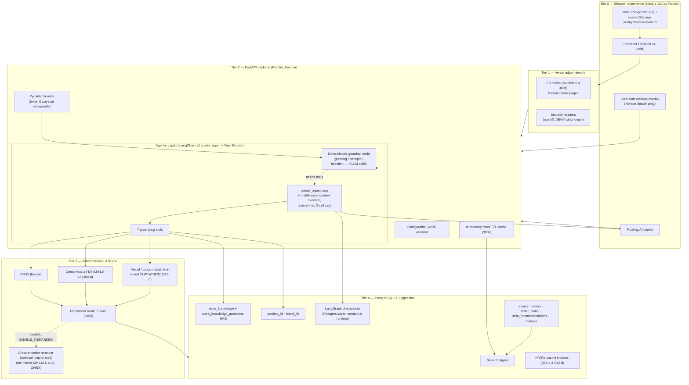
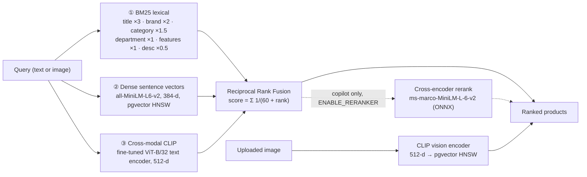
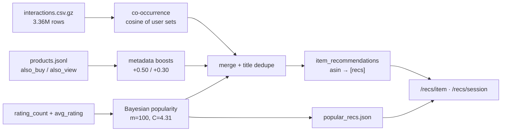

# Toko Marcell — Multimodal Hybrid Retrieval & Agentic AI E-Commerce Engine

[](https://toko-marcell.vercel.app)
[](https://python.org)
[](https://pytorch.org)
[](https://huggingface.co/Marcell-Kristianto/toko-marcell-clip)
[](https://github.com/pgvector/pgvector)
[](https://fastapi.tiangolo.com)
[](https://langchain.com)
[](https://openrouter.ai/)
[](https://nextjs.org)
[](https://docker.com)
[](./.github/workflows/ci.yml)

> **Toko Marcell** is an end-to-end, production-deployed e-commerce platform built from scratch to
> benchmark and serve **Multimodal Foundation Models (VLMs)**, **hybrid lexical–dense–visual vector
> retrieval**, and an **agentic AI shopping copilot with grounded RAG** over a real catalog of
> **4,670 curated products** (built from an initial 6,000 candidate extract).

| | |
|---|---|
| 🌐 **Live storefront** | [https://toko-marcell.vercel.app](https://toko-marcell.vercel.app) |
| ⚡ **Live API / interactive docs** | [https://toko-marcell-api.onrender.com/docs](https://toko-marcell-api.onrender.com/docs) |
| 🧠 **Fine-tuned CLIP on HF Hub** | [Marcell-Kristianto/toko-marcell-clip](https://huggingface.co/Marcell-Kristianto/toko-marcell-clip) |
| 🔬 **Research report (failure analysis)** | [`pipelines/failure_case_analysis.md`](./pipelines/failure_case_analysis.md) |
| 📑 **Literature review (CLIP fine-tuning)** | [`pipelines/literature_review_clip_finetuning.md`](./pipelines/literature_review_clip_finetuning.md) |
| 📊 **Machine-readable leaderboard** | [`pipelines/multimodal_benchmark_results.json`](./pipelines/multimodal_benchmark_results.json) |
| 🧾 **Benchmark source ledger** | [`pipelines/BENCHMARKS.md`](./pipelines/BENCHMARKS.md) — what each number is and how to reproduce it |

> **Note on the live API:** the backend runs on Render's free tier, so it sleeps after 15 minutes of
> inactivity and takes 30–50 s to wake. The storefront handles this explicitly with a health-check
> overlay (see [Cold-start UX](#-cold-start-ux-turning-a-free-tier-constraint-into-a-feature))
> instead of silently failing. The catalog itself is served from Vercel's edge cache and stays fast.

---

## TL;DR

**Toko Marcell is a working e-commerce engine, not a UI mock** — a Next.js storefront, a FastAPI
backend and PostgreSQL + pgvector, over a real 4,670-product catalog, deployed live.

**The five things worth inspecting** (each backed by a committed artifact):

| # | What | Result | Where |
|---|---|---|---|
| 1 | **VLM fine-tuning study** — 4 fine-tuning strategies vs a zero-shot baseline, 5,378 image–text pairs, 539 held-out test | champion lifts text→image **Recall@1 26.53% → 39.15%** (+47.57% rel) | [leaderboard](./pipelines/multimodal_benchmark_results.json) |
| 2 | **Hybrid retrieval** — BM25 + MiniLM (384-d) + CLIP (512-d) → RRF (k=60); optional ONNX cross-encoder on the copilot path | exact SKUs *and* semantic/visual queries; `?mode=` switchable | [API internals](./api/README.md#search--how-it-ranks) |
| 3 | **Grounded agentic copilot** — LangChain v1 `create_agent` + OpenRouter (free tier), deterministic zero-LLM guardrail, 7 tools, LangGraph Postgres memory, hypothetical-question policy RAG | answers only from tool evidence; refuses off-topic and injection attempts without an LLM call | [copilot](./README.md#-the-agentic-copilot-admin-toko-marcell) |
| 4 | **Recommendations from real behaviour** — 3.36 M interactions | co-occurrence + Bayesian popularity, session-aware, cold-start safe | [recommendation engine](./README.md#-recommendation-engine) |
| 5 | **Review-derived fit & sizing** — 622,530 fit mentions regex-mined from 3.36 M reviews | per-product/brand `runs_small / true_to_size / runs_large`, Dirichlet-smoothed, surfaced as fit badges + copilot `recommend_size` | [review-derived fit](./README.md#-review-derived-fit--sizing) |

**Measured results** (committed artifacts in [`pipelines/results/`](./pipelines/results/)):

| Benchmark | Metric | BM25 | Hybrid | Hybrid+Rerank | Trimodal |
|---|---|:---:|:---:|:---:|:---:|
| IR (32 queries) | nDCG@10 | 0.794 | **0.879** | 0.893 | 0.908 |
| IR (32 queries) | MRR@10 | 0.792 | **0.906** | 0.885 | 0.932 |
| IR — Indonesian (8q) | nDCG@10 | 0.334 | 0.622 | 0.739 | **0.821** |

| Recs (5 K users) | HR@10 | nDCG@10 |
|---|:---:|:---:|
| Random | 0.22% | 0.0011 |
| Popularity | 0.18% | 0.0008 |
| **Item-to-Item CF** | **7.96%** | **0.0501** |

| RAG retrieval (12 ID+EN queries) | HR@1 | HR@3 | MRR@3 |
|---|:---:|:---:|:---:|
| Direct-chunk | 0.250 | 0.333 | 0.292 |
| **Hypothetical-question** | **0.750** | **0.917** | **0.819** |

Indexing a few template-generated hypothetical questions per policy chunk roughly triples HR@1 over
embedding the raw chunk text (artifacts: [`pipelines/results/rag_eval.json`](./pipelines/results/rag_eval.json),
[`pipelines/eval_rag.py`](./pipelines/eval_rag.py)).

**Multilingual embedding A/B** ([`pipelines/results/search_eval_multilingual.json`](./pipelines/results/search_eval_multilingual.json)):
`paraphrase-multilingual-MiniLM-L12-v2` lifts overall hybrid nDCG@10 0.879 → 0.894 and the
Indonesian group 0.622 → 0.765, but roughly doubles peak RSS (~1024 MB vs ~610–650 MB) with both
CLIP ONNX encoders loaded — so MiniLM stays the default and the multilingual model is opt-in.

The cross-encoder reranker improves nDCG@10 overall (+1.4 pts vs hybrid) and substantially on
Indonesian queries (+0.117), but slightly lowers MRR@10 overall (0.906 → 0.885). On Category/Attr
it drops nDCG (0.990 → 0.940). Net: a modest positive, strongest on the hardest group.

**Stack:** Next.js 16 · React 19 · FastAPI · PostgreSQL 16 + pgvector · PyTorch/CLIP · LangChain +
OpenRouter (free tier, Gemini fallback) · Docker · Vercel + Render + Neon.

**Try it locally**

Prerequisite: **Docker with Compose**. Nothing else — Python, Node and PostgreSQL are not needed on
the host, and the database seeds itself on first boot.

```bash
# 1. get the code
git clone https://github.com/marknshoot/toko-marcell.git
cd toko-marcell

# 2. (optional) enable the AI copilot with a free OpenRouter key
#    https://openrouter.ai/keys  — skip this and everything else still works
cp .env.example .env        # then set OPENROUTER_API_KEY=... in .env

# 3. start the full stack
./run-local.sh              # → http://localhost:3000
```

`run-local.sh` also **prompts for the key** if `.env` is empty — press Enter to skip. Pressing Enter
leaves the copilot disabled; the rest of the site is unaffected.

| Works with no configuration | Needs an LLM key (OpenRouter, or Gemini as fallback) |
|---|---|
| catalog, hybrid text search, recommendations, reviews, demo checkout | the copilot's answers (`/copilot/chat` returns a friendly `503` without one) |

Or use the hosted build: [storefront](https://toko-marcell.vercel.app) / [API docs](https://toko-marcell-api.onrender.com/docs).

**Scope, honestly:** the storefront, QRIS checkout, couriers and order flow are a **demo simulation** —
they charge nothing and ship nothing. What is real: the catalog, the vector search, the ML study, the
recommendations and the agent's grounding. Every headline number is tagged in
[`BENCHMARKS.md`](./pipelines/BENCHMARKS.md) as committed-artifact / locally-reproducible /
author-measured. Open gaps are in [Honest limitations](#-honest-limitations--what-is-not-built).

---

## Why this project exists

This is a portfolio project, and it is deliberately **not** a CRUD tutorial with a prettier homepage.
It exists to demonstrate four things a hiring manager can verify rather than take on trust:

1. **A real ML research loop** — hypothesis → controlled ablation → measured leaderboard → failure
   analysis → production export. Not a notebook that trains once and is never evaluated.
2. **Information retrieval engineering** — three independent rankers (BM25, dense sentence vectors,
   cross-modal CLIP) fused with Reciprocal Rank Fusion, plus an optional cross-encoder reranker on the copilot path.
3. **Grounded LLM application engineering** — a LangChain v1 `create_agent` loop that can only speak
   from tool results, fronted by a deterministic zero-LLM guardrail, with a 7-tool whitelist,
   prompt-injection/off-topic refusal, token-budget and model-call-count safeguards, and tests.
4. **Systems that survive free-tier reality** — cold starts, edge caching, in-memory TTL caches,
   server-authoritative checkout (a tampered price is rejected, not ignored).

Every number below is either measured and stored in the repository or read from the code at runtime.
Nothing is invented. Where something is simplified or unfinished, it is written down as such in
[Honest limitations](#-honest-limitations--what-is-not-built).

---

## Table of contents

- [TL;DR](#tldr)
- [System architecture](#-system-architecture)
- [Research pillar 1 — the VLM contrastive fine-tuning study](#-research-pillar-1--the-vlm-contrastive-fine-tuning-study)
- [Research pillar 2 — tri-modal hybrid retrieval](#-research-pillar-2--tri-modal-hybrid-retrieval)
- [Recommendation engine](#-recommendation-engine)
- [Review-derived fit & sizing](#-review-derived-fit--sizing)
- [The agentic copilot](#-the-agentic-copilot-admin-toko-marcell)
- [Cold-start UX](#-cold-start-ux-turning-a-free-tier-constraint-into-a-feature)
- [Production reliability, caching & defensive security](#-production-reliability-caching--defensive-security)
- [The data behind it](#-the-data-behind-it)
- [Quickstart — one command](#-quickstart--one-command)
- [Repository map](#-repository-map)
- [Testing & CI](#-testing--ci)
- [Design decisions & tradeoffs](#-design-decisions--tradeoffs-worth-reading)
- [Honest limitations — what is *not* built](#-honest-limitations--what-is-not-built)
- [Roadmap](#-roadmap)
- [Author](#-author)
- [Data licence & attribution](#-data-licence--attribution)

---

## 🏗️ System architecture

Four tiers, each with a single job. The storefront never opens a database connection; the backend
never renders HTML; the ML pipelines never serve a request.



### Tier responsibilities

| Tier | Technology | Owns | Explicitly does **not** |
|---|---|---|---|
| 0 — Client | Next.js 16 (App Router), React 19, Tailwind v4 | Rendering, cart state, session id, cold-start UX | Touch the database, know prices |
| 1 — Edge | Vercel CDN + ISR | Caching product pages, security headers | Hold business logic |
| 2 — API | FastAPI, Pydantic, LangChain, OpenRouter | REST validation, search, recs, copilot, checkout | Render HTML |
| 3 — Retrieval | BM25, fastembed (MiniLM + CLIP), ONNX reranker | Ranking | Persist state |
| 4 — Storage | PostgreSQL 16 + pgvector (Neon) | Catalog, vectors, events, orders, reviews, knowledge | Serve HTTP |

The single hard rule that keeps this clean: **the frontend never opens a database connection — it
only ever talks HTTP** (`shop/src/lib/api.js` is the only place that knows the API URL).

---

## 🔬 Research pillar 1 — the VLM contrastive fine-tuning study

**The problem.** General-purpose CLIP (`openai/clip-vit-base-patch32`) is good at separating a dog
from a car and bad at separating clean dress chinos from rugged work pants, a relaxed straight cut
from a slim taper, or glossy waterproof nylon from matte fleece. These "fine-grained semantic gaps"
are exactly where e-commerce search lives. The study asks a specific, testable question:

> If we domain-adapt CLIP on this catalog, **which fine-tuning strategy** buys the most retrieval
> accuracy, and **where does it still fail?**

### Dataset

- **5,378 verified image–text pairs** extracted from the catalog, split deterministically
  (seed 42) into **4,302 train / 537 val / 539 test** (`pipelines/prepare_clip_dataset.py`).
- 622 pairs were skipped because the cached image was missing — the split summary records this.
- Captions are **structured**, not marketing prose:
  `Brand + Title + (Category / Department) + first fabric feature bullets`.
  The literature review (Chia et al., 2022) found structured captions outperform raw titles by a
  wide margin on fashion recall; this pipeline follows that finding.

### Method

Four adaptation hypotheses (plus a zero-shot reference), each derived from a paper (see
[`literature_review_clip_finetuning.md`](./pipelines/literature_review_clip_finetuning.md)):

| Experiment | What it changes | Source idea |
|---|---|---|
| **Zero-shot (reference)** | Frozen pretrained CLIP — the number to beat | — |
| **LoRA** | Freeze base, train low-rank adapters on `q_proj, v_proj` | Hu et al., LoRA (2021) |
| **SigLIP** | Replace batch softmax with pairwise sigmoid loss | Zhai et al., SigLIP (2023) |
| **WiSE-FT** | Weight-space ensemble of fine-tuned + zero-shot | Wortsman et al. (2022) |
| **Decoupled LR 🏆** | Freeze ViT layers 0–5, asymmetric LRs per module | Wortsman et al. (2022) |

Training ran on **Kaggle GPU — NVIDIA Tesla T4 16 GB**, mixed precision (AMP FP16),
3 epochs, batch size 64, base LR 5e-6. The exact run configuration lives in
[`multimodal_benchmark_results.json`](./pipelines/multimodal_benchmark_results.json).

### Benchmark scoreboard (539 held-out test pairs)

| Experiment | Architecture / approach | Recall@1 | Recall@5 | Recall@10 | MRR | Latency (T4) |
|---|---|:---:|:---:|:---:|:---:|:---:|
| Zero-shot base | `openai/clip-vit-base-patch32` (frozen) | 26.53% | 54.92% | 70.69% | 0.4033 | 27.80 ms |
| PEFT LoRA | LoRA, early-stopped, r=16, α=32 on `q_proj, v_proj` | 33.40% | 71.61% | 83.49% | 0.5038 | 15.50 ms |
| SigLIP | Pairwise sigmoid loss, learnable temperature/bias | 35.25% | 71.43% | 82.19% | 0.5091 | 19.38 ms |
| WiSE-FT | Weight-space ensemble (decoupled LR + zero-shot, α=0.35) | 37.85% | 73.28% | 85.53% | 0.5363 | 9.76 ms |
| **🏆 Champion — Decoupled LR** | ViT 0–5 frozen · vision 0.2× · text 1.0× · projection 2.0× | **39.15%** | **78.11%** | **87.20%** | **0.5592** | **14.01 ms** |

**Headline result: Recall@1 26.53% → 39.15% = +12.62 points absolute, +47.57% relative.**

### What the results actually say

1. **Decoupling the learning rate across depths beat every structurally cleverer alternative.**
   Freezing the early ViT blocks preserves generic edge/texture filters, while a 2× LR on the
   projection heads adapts the shared embedding space fastest. LoRA (a *more* parameter-efficient
   method) landed 5.75 points lower on Recall@1 — this is a useful, counter-intuitive finding.
2. **Weight-space ensembling is a strong, cheap regularizer** (37.85% R@1) and the fastest at
   inference (9.76 ms), making it a good candidate for a latency-constrained deployment even though
   it is not the accuracy champion.
3. **SigLIP's pairwise loss is competitive but not dominant here**, which is plausible: at
   batch 64 the false-negative pressure that SigLIP removes is smaller than in the small-batch
   regime the paper targets.
4. **The champion was exported for production**, not left in a notebook: the text encoder went to
   ONNX and is downloadable at runtime from Hugging Face Hub
   ([`Marcell-Kristianto/toko-marcell-clip`](https://huggingface.co/Marcell-Kristianto/toko-marcell-clip)).
   Serving uses ONNX Runtime on CPU (< ~150 MB RAM, 2 intra-op threads, graph optimizations on).

### Failure-mode analysis

[`pipelines/failure_case_analysis.md`](./pipelines/failure_case_analysis.md) is the qualitative
half of the study: it dissects cases where rank improved dramatically or did not, e.g. distressed
denim texture, the structural drape of 8.5 oz twill, and specular sheen on waterproof nylon. The
remaining known failure mode is **sub-brand logo invariance** (e.g. a small embroidered logo patch),
proposed fix multi-crop / RoI-Align training. The research report's *qualitative* case section and
the *aggregate* scoreboard in this README come from different evaluation passes; the aggregate table
here is the authoritative Kaggle 4-way leaderboard stored in the JSON above.

---

## ⚡ Research pillar 2 — tri-modal hybrid retrieval

Pure vector search fails on exact tokens (SKU numbers, model numbers like `501`, brand names).
Pure lexical search fails on typos, synonyms, and conversational intent. Toko Marcell runs all the
rankers that matter and fuses them.



### 1. BM25 — a real, hand-written baseline

`api/search.py` implements Robertson & Zaragoza BM25 (`k1=1.5`, `b=0.75`, +1 IDF smoothing) with
**zero search dependencies**, because a baseline is only useful if it is honest enough to beat.
Field weighting (title 3.0 → description 0.5) is a practical alternative to one index per field;
BM25's saturation handles fractional term frequencies fine. The tokenizer does lowercase → accent
folding → alphanumeric filtering → stopword removal → a small **plural fold** (`sneakers→sneaker`,
`jeans→jean`). It is *not* a Porter stemmer; that limitation is stated where it lives, in the code.

Why in-process? At this catalog size the whole index rebuilds in well under a second and lives
comfortably in RAM, so an external service would add a dependency for nothing. Known gaps are
deliberate: no typo tolerance, no synonyms, no phrases — and those gaps are precisely what the
embedding half exists to close. That is why the baseline was measured *first*.

**Honest baseline behaviour (measured in `api/tests/test_search_unit.py` + manual probing):**

```
'levis 501'            → exact model numbers, four distinct variants
'waterproof jacket'    → raincoats and watertight shells
'shoes'  == 'shoe'     → plural folding makes the two score identically
'zzzz'                 → 0 results (no matching postings, returns immediately)
```

**Duplicate-title suppression.** 842 of the 6,000 built products are variants sharing a title with a
different ASIN. Without dedupe, a query like `jeans` shows the same title twice in the top 10.
Dedupe runs *before* pagination so `total` counts results a shopper can actually reach.

### 2. Dense semantic retrieval

384-dimensional `sentence-transformers/all-MiniLM-L6-v2` embeddings (via **fastembed**, ONNX runtime)
stored in a `vector(384)` column with an **HNSW cosine index**. Text representation =
`title + brand + category + features + description`. This ranker is what lets "shoes for women" and
"white sneakers" work without exact token overlap.

### 3. Cross-modal visual retrieval

An uploaded photo is encoded with the **fine-tuned CLIP vision tower** to a 512-d vector and matched
against `products.image_embedding` (HNSW cosine). The same 512-d space lets a *text* query search
product *images* (`mode=trimodal`) — so "waterproof hooded packable rain jacket nylon shell" can be
retrieved by the visual sheen of the garment, not only by words. Encoders are loaded lazily and
cached per process. The champion fine-tuned encoders are served as **ONNX** (no `torch`): the text
tower is fp16 (~127 MB) and the vision tower is int8 (~96 MB), both published and fetched at runtime
([`pipelines/export_text_onnx.py`](./pipelines/export_text_onnx.py),
[`pipelines/export_vision_onnx.py`](./pipelines/export_vision_onnx.py)). If no champion vision
encoder is present, image search returns `503` rather than falling back to a mismatched zero-shot
space.

### 4. Reciprocal Rank Fusion (k = 60)

$$
\text{RRF}(d) = \sum_{m \in M} \frac{1}{60 + r_m(d)}
$$

RRF is used instead of score normalization because BM25 scores are unbounded positives while cosine
similarities are bounded in [-1, 1]; RRF needs only *ranks*, so the heterogeneous rankers can be
combined with no calibration and no per-query tuning. `k=60` is the constant from
Cormack, Clarke & Buettcher (2009).

### 5. Stage-2 cross-encoder reranking (optional, copilot path)

The HTTP `/search` endpoint returns the RRF order. The copilot's `search_catalog` tool can add a
second stage behind the `ENABLE_RERANKER` flag (off on the 512 MB deployment, on in local Compose):
top candidates are re-scored by `Xenova/ms-marco-MiniLM-L-6-v2` run through **ONNX Runtime**
(~15–25 ms for ~20 candidates). A cross-encoder sees the query and document *together*, so it
captures relevance a bi-encoder cannot — the standard two-stage retrieve-then-rerank pattern.
If the model cannot be downloaded, the code logs a warning and returns the Stage-1 order, so the
search endpoint degrades rather than breaks.

### Evaluation harness

`pipelines/eval_search.py` ships a **32-query benchmark** across four groups — exact brand/SKU,
category + explicit features, semantic/intent, and Indonesian/casual cross-lingual — and reports
HitRate@10, Precision@10, MRR@10 and nDCG@10 for **BM25 vs hybrid**, with a group breakdown and
relative gains. `mode=bm25|vector|hybrid|trimodal` is returned in every response so the eval harness
and the UI can always tell which ranker produced a result set instead of inferring it.

### Multilingual embedding A/B (opt-in)

Many shoppers type Indonesian. `pipelines/results/search_eval_multilingual.json` records a hybrid-mode
A/B of `paraphrase-multilingual-MiniLM-L12-v2` against the default `all-MiniLM-L6-v2`: overall
nDCG@10 **0.879 → 0.894**, MRR@10 **0.906 → 0.919**, and the Indonesian query group nDCG@10
**0.622 → 0.765**. The catch is memory — peak RSS with both CLIP ONNX encoders loaded is **~1024 MB**
vs **~610–650 MB** for MiniLM, which overruns the 512 MB free tier. So MiniLM stays the default and
the multilingual model is **opt-in** via `TEXT_EMBED_MODEL` + `TEXT_EMBED_COLUMN=embedding_ml` (the
`embedding_ml` column already ships in the seed).

### Hypothetical-question RAG

The copilot's policy answers retrieve from `store_knowledge`, but embedding a raw policy chunk and
embedding the question a shopper actually asks live in different parts of the vector space.
`pipelines/eval_rag.py` quantifies the gap on **12 labelled ID+EN queries**
([`pipelines/results/rag_eval.json`](./pipelines/results/rag_eval.json)): direct-chunk retrieval
scores HR@1 **0.250** / HR@3 0.333 / MRR@3 0.292, while indexing **82 template-generated hypothetical
questions** (3–5 ID+EN per chunk, in `store_knowledge_questions`) lifts it to HR@1 **0.750** / HR@3
**0.917** / MRR@3 **0.819** — roughly triple HR@1.

---

## 🎯 Recommendation engine

Search answers "find me this". Recommendations answer "what next" — the surface where most e-commerce
demos cheat with a hard-coded "you may also like". There is none of that here: every rail is built
from the real **3.36 M-interaction log** and the catalog's own co-buy graph, then served through a
fallback chain so a **cold visit still gets a useful rail**.

### Serving, and why every request has an answer

| Surface | Endpoint | Mechanism | Cold fallback |
|---|---|---|---|
| Home rail | `GET /recs/session` | the visit's last 5 `view_product` / `add_to_cart` events → union of their item recs, excluding seen items | global popularity (`cold_popularity`) |
| Product page | `GET /recs/item/{asin}` | offline item-to-item table (`item_recommendations`) | same category → department popularity |
| Browse / cold | `GET /recs/popular` | review-volume ordering, optional department filter | — |

Each response includes a `strategy` field (`session_cf`, `item_cf`, `category_popularity_fallback`,
`cold_popularity`), so the UI can say *how* a rail was produced rather than guessing.

### The offline model (`pipelines/build_recs.py`)

1. **Popularity, Bayesian-smoothed.** A raw average rating rewards a product with three 5-star
   reviews. The baseline shrinks it toward the catalog mean instead:
   $\text{score} = (n\bar{r} + mC)/(n + m)$ with prior weight **m = 100** and prior mean **C = 4.31**.
   Global top-50 and top-30 per department, deduplicated by title.
2. **Item-to-item co-occurrence.** Cosine similarity over per-item user sets,
   $\cos(i,j) = co(i,j)/\sqrt{n_i}\,\sqrt{n_j}$, where `co` counts users who interacted with both.
   Ultra-popular items are capped at 5,000 sampled users so the candidate product stays bounded.
3. **Metadata boosts.** Amazon's `also_buy` adds **+0.50** and `also_view` **+0.30** to a candidate's
   score, so explicit co-purchase signals beat coincidental co-views.
4. **Title dedupe + cold fill.** Variants of the same title are collapsed; each item keeps up to 12
   recommendations, and anything with fewer than 6 is backfilled from category-popular then
   department-popular items — so no rail is ever empty.



### Why session-based, not user-based

The store has **no accounts** — deliberately, since the funnel needs to attribute a *visit*, not a
person, and carrying no PII is a feature. So online personalization uses the anonymous
`sessionStorage` id and the current visit's events, while the offline co-occurrence table supplies
long-horizon behaviour. That is the cold-start problem answered at four levels
(session → item → category → global), not hidden behind a login wall.

### Evaluation

`pipelines/eval_recs.py` runs **sequential leave-one-out** on users with ≥5 interactions: the target is
the user's final interaction and the penultimate item is the session context (a realistic "current
product page"), with everything else masked. It reports HR@10 / HR@5 / MRR@10 / nDCG@10 against random
and popularity baselines.

---

## 📏 Review-derived fit & sizing

Fashion returns are driven by fit, and shoppers do not trust a generic size chart — they trust other
shoppers. `pipelines/build_fit_signals.py` turns the review corpus into a per-product fit signal so
the storefront and the copilot can answer "does this run small?" from evidence, not guesswork.

### The pipeline

1. **Regex mining with negation handling.** The pipeline streams all **3,363,680** catalog reviews
   and classifies each fit mention as `runs_small`, `true_to_size` or `runs_large`, handling negations
   (so "doesn't run small" is not counted as `runs_small`). **622,530 fit mentions** are extracted —
   **18.5%** of reviews carry a usable fit signal.
2. **Dirichlet smoothing.** Per-product counts are smoothed (α = 10) toward the department prior, so a
   product with three reviews is not declared "runs large" on noise.
3. **Brand fallback.** When a product has fewer than 5 mentions, its label falls back to the
   brand-level signal in `brand_fit`.

**Coverage** of the 6,000 built ASINs: **99.8%** have ≥ 1 fit mention, **98.1%** have ≥ 5, **90.9%**
have ≥ 20. Two tables ship in the seed: `product_fit` (**4,670 rows**, the served catalog) and
`brand_fit` (**1,495 brands**). The classifier is covered by **40 regex unit tests**.

### Data-driven brand corrections

Mining the actual reviews overturned several "common knowledge" sizing rules that an authored chart
would have gotten wrong:

- **Champion is *not* "runs large"** — 25.4% of mentions say it runs small vs 19.5% large → **true to size**.
- **Carhartt** is only slightly roomy → **true to size**.
- **Dickies runs small** (35.7% of mentions say small).
- **Levi's** → **true to size**.
- **Birkenstock runs large** → size down.

### The structured size source of truth

`api/knowledge/size_chart.json` is the structured source (TB/BB tops, waist bottoms, footwear, and
per-brand offsets), labelled **"panduan umum toko"** — a store rule-of-thumb, explicitly *not* an
official brand chart. `size_charts.md` explains it in prose for the RAG index.

The copilot's `recommend_size` tool reads this plus the product/brand fit signal in a **3-layer**
scheme (product fit → brand fit → chart offset) and always returns an **advisory**, never a
certainty.

### Serving

`GET /products/{id}` now includes a `fit` object (`label`, `source` = `product` | `brand`,
`nMentions`, `shares`, `fitScore`, `phrasing`, `disclaimer`) or `null` when there is no signal, and a
dedicated `GET /products/{id}/fit` endpoint exposes the same. The storefront renders these as **fit
badges** on product cards and the product page.

---

## 🤖 The agentic copilot (Admin Toko Marcell)

An in-store stylist and customer assistant built on **LangChain v1 `create_agent`** (langchain
1.4.3, langgraph 1.2.12), split across `api/copilot_agent.py`, `api/copilot_tools.py`,
`api/copilot_llm.py`, `api/copilot_memory.py` and `api/guardrail.py`. The provider is **OpenRouter**
(OpenAI-compatible) whenever `OPENROUTER_API_KEY` is set — its free tier is far more generous than
Gemini's — with an optional generic OpenAI-compatible endpoint and **Google Gemini** behind it. The
design principle is boring on purpose: **the model never invents a product, a price, or a policy.**

**Text-only on purpose — the chat does not accept images.** The copilot runs on a text LLM, so it
takes no `image_url`/`imageUrl` and binds no `search_by_image` tool. Free vision-capable models have
very small request quotas, so no multimodal LLM is used. **Photo search still exists in the
storefront** via `POST /search/image` (the CLIP vision encoder embeds the upload and matches
`image_embedding` deterministically) — it is just a separate storefront feature, not a chat turn.

### Execution model

```mermaid
sequenceDiagram
    participant S as Shopper
    participant API as /copilot/chat
    participant G as Guardrail (deterministic, 0 LLM)
    participant A as create_agent loop (≤ 3 model calls)
    participant T as 7 tools
    participant D as Postgres + pgvector (incl. checkpointer)
    S->>API: {thread_id, message, context?}
    API->>G: classify
    Note over G: greeting / off-topic / injection<br/>→ canned reply, ZERO LLM calls
    G-->>API: canned reply (guardrail hit)
    G->>A: otherwise, run the agent
    Note over A: middleware injects page/pinned product,<br/>shown-products registry, browsing context;<br/>trims history; caps model calls at 3
    A->>T: tool calls
    T->>D: catalog / details / reviews / size / outfit / policy / cart
    D-->>T: authoritative rows
    T-->>A: compacted evidence
    A->>D: persist turn (PostgresSaver, thread_id)
    A-->>S: reply + products[≤6]+fit + citations + suggestions + ui_actions
```

1. **Deterministic guardrail (`api/guardrail.py`).** Before any LLM runs, greetings/thanks/identity,
   off-topic requests (code, SQL, maths, politics, medical/legal, creative) and prompt-injection
   attempts get a canned "Admin Toko Marcell" reply with **zero LLM calls**. Anything else goes to
   the agent. The response carries a `guardrail` field (`greeting` | `off_topic` | `injection` |
   `null`) and the tests assert it.
2. **`create_agent` loop.** The agent plans tool calls, runs them, and composes the grounded reply in
   a single LangGraph loop. **Middleware** wraps it: `ContextInjectionMiddleware` injects the current
   page / pinned product (re-read from the DB), a `[Produk dalam percakapan ini] [1]…` shown-products
   registry and recent browsing context; `TrimHistoryMiddleware` keeps history under a 2,000-token
   budget (char/4 estimate); `ModelCallLimitMiddleware` caps the turn at **3 model calls**.
3. **Grounded reply.** Products, prices and policy all come from tool evidence, in the "Admin Toko
   Marcell" voice (Indonesian or English, mirroring the shopper).

### The tool layer

Seven tools are bound to the agent (`GET /copilot/tools` lists them):

| Tool | Reads from | Answers |
|---|---|---|
| `search_catalog` | BM25 + MiniLM (pgvector) fused with RRF, optional reranker, real category enum + budget filters | "do you have…", style, outfit, budget |
| `get_product_details` | `products` by registry ref (`nomor 2`, `produk ini`), ASIN/id, or title fragment | fabric, specs, exact IDR price |
| `get_product_reviews` | `reviews`, with a topic filter (fit / size / fabric / durability) | aspect-level social proof |
| `recommend_size` | `size_chart.json` + product/brand fit, 3-layer (product → brand → chart offset) | TB/BB sizing advisory, never a certainty |
| `build_outfit` | catalog search; total summed and verified ≤ budget **in code** | top + bottom + shoes within budget |
| `lookup_store_policy` | `store_knowledge` / `store_knowledge_questions` (hypothetical-question RAG) | sizing (TB/BB), shipping, returns, QRIS demo |
| `add_to_cart` | re-reads the price from the DB, returns a `ui_action` the browser executes | "add this to my cart" |

Tool *results* are compacted before they re-enter the prompt — a token-budget safeguard that also
keeps answers focused. There is deliberately **no order-status tool**, because checkout is a demo
simulation with no fulfillment to look up.

### Grounding rules baked into the prompt

- Every product mentioned must come from a tool result. No invented brands, ASINs, stock, or discounts.
- Prices are always formatted as Indonesian Rupiah and always taken from the database.
- Sizing answers apply **data-driven brand cut rules** from the knowledge base and the review-mined
  fit signal — e.g. Dickies 874's rigid 8.5 oz twill (and that **Dickies runs small**), Levi's 505 vs
  501 fit differences (Levi's **true to size**), that **Champion and Carhartt are true to size**
  (not "runs large", per the mined reviews), and that **Birkenstock runs large** (size down). These
  are authored in [`api/knowledge/size_charts.md`](./api/knowledge/size_charts.md) and
  [`api/knowledge/size_chart.json`](./api/knowledge/size_chart.json), not hallucinated.
- Outfit recommendations must sum to a total inside the shopper's stated budget.
- Off-topic requests are politely refused and redirected to fashion.

### Memory and session context

Conversation memory is a **LangGraph `PostgresSaver`** keyed by a browser-generated UUID `thread_id`
stored in `localStorage` under `tm_copilot_thread`. A sidecar `copilot_thread_activity` table tracks
last-touch time; a **7-day TTL cleanup** runs on startup and daily. `GET /copilot/threads/{thread_id}`
returns a thread's messages and `DELETE /copilot/threads/{thread_id}` clears it (`204`). The
checkpoint tables are created by the saver at runtime, not shipped in the seed.

Before the agent runs, `ContextInjectionMiddleware` also injects the shopper's recent
`view_product` / `add_to_cart` events and any page/pinned product — so "do you have these in black?"
has a referent.

### Provider chain and deterministic testing

The LLM is assembled with `.with_fallbacks`: **OpenRouter** (primary) → an optional generic
OpenAI-compatible endpoint (`LLM_FALLBACK_BASE_URL` / `LLM_FALLBACK_API_KEY` / `LLM_FALLBACK_MODEL`)
→ **Gemini**. Setting `COPILOT_FAKE_LLM=1` swaps in a deterministic fake tool-calling model, so CI
exercises the full agent and tool path **without ever calling a real LLM**.

### API contract (v2)

`POST /copilot/chat` accepts `{session_id?, thread_id, message (1..2000), context?: {page_asin?,
referenced_asins[≤3]}}` with `extra="forbid"`. It returns `{reply, thread_id, products[≤6] (each
with a `ref` and `fit`), citations, suggestions (2–3 follow-up chips), ui_actions (`add_to_cart` |
`size_form`), tool_calls, guardrail, took_ms}`. Errors are `422` (validation), `429` (rate limit),
`503` (no LLM key) and `502` (upstream failure). `GET /copilot/tools` returns the 7 tool names.

### Knowledge base (RAG)

`api/knowledge_seed.py` chunks the two hand-written markdown sources
([`size_charts.md`](./api/knowledge/size_charts.md),
[`store_policies.md`](./api/knowledge/store_policies.md)) by section header, embeds each chunk with
MiniLM, and upserts them into `store_knowledge` (**23 chunks** in the seed). It also generates **82
hypothetical questions** (3–5 ID+EN per chunk) into `store_knowledge_questions` and indexes those —
embedding questions a shopper would actually ask rather than the raw policy text roughly triples
HR@1 (see [Research pillar 2](#-research-pillar-2--tri-modal-hybrid-retrieval)). Nothing here is
scraped; it is authored store policy, which is why the copilot can be trusted about shipping, returns
and sizing.

---

## ⏱️ Cold-start UX: turning a free-tier constraint into a feature

Render's free tier spins the API down after ~15 minutes idle. The naive result is a storefront that
appears broken for 30–50 seconds. `shop/src/components/ServerWakeup.js` turns that into a designed
state:

- A debounced (600 ms) `GET /health` fires on first mount. If the server answers immediately, the
  overlay never appears — fast paths stay fast.
- If it does not, a **fullscreen frosted-glass overlay** shows a spinner and an honest message
  (*"Membangunkan server… Render free tier cold start (~30–50 dtk)"*).
- On success it flips to a green badge (*"Server siap & aktif!"*) for 2.5 s and unmounts.
- On failure it offers **retry** and **dismiss**, so the user is never trapped.

`checkHealth()` falls back to `/categories` if `/health` is blocked by a client shield/extension,
because a false "down" is worse than a slightly heavier probe.

---

## 🛡️ Production reliability, caching & defensive security

Built to be fast and honest on free infrastructure (Vercel + Render + Neon).

### Caching (three layers, each with a reason)

| Layer | Where | Setting | Why |
|---|---|---|---|
| Edge ISR | `app/product/[id]/page.js` | `revalidate = 300` | Product pages are read-heavy and change rarely; stale-while-revalidate removes origin latency on repeat visits |
| HTTP | Catalog endpoints | `public, max-age=60, s-maxage=300, stale-while-revalidate=60` | Lets any CDN/proxy cache; short browser TTL keeps the demo fresh |
| In-memory TTL | `/categories` facets | 300 s dict cache | Replaces a `GROUP BY` aggregate scan on every page load (~60 ms → ~2 ms) |

`POST /search/reindex` rebuilds the BM25 index **and** invalidates the facet cache, because after a
reseed the old index is silently stale and "why are my new products not searchable" is otherwise a
confusing hour.

### Defensive boundaries

- **AI token safeguard.** `/copilot/chat` enforces strict Pydantic bounds: ≤ 2,000 chars for the
  single message per turn, `extra="forbid"` on the request body, and no image payload (the chat is
  text-only). Oversized or malformed requests get a `422`, not a metered bill.
- **Server-authoritative checkout.** The client sends only `{asin, qty}`; the server looks up every
  price and computes the total. `ConfirmIn` sets `extra="forbid"`, so a request that *tries* to send
  a price is **rejected with a 422** rather than silently ignored. A tampered "pay Rp 1" is structurally
  impossible.
- **Image-search bounds.** MIME must be `image/*`, payload must be 50 bytes–10 MB; the copilot client
  caps uploads at 5 MB.
- **Configurable CORS.** `CORS_ORIGINS` is an allowlist in code (default `localhost` +
  `https://toko-marcell.vercel.app`) with an explicit `^https://.*\.vercel\.app$` regex so preview
  deployments work. The shipped Render blueprint sets `CORS_ORIGINS=*` so that every preview URL
  works without redeploys — a deliberate tradeoff, acceptable here because the API is stateless,
  credential-free, and sets no cookies. It is documented rather than hidden.
- **Frontend hardening.** `next.config.mjs` sets `X-Content-Type-Options: nosniff`,
  `X-Frame-Options: DENY`, `Referrer-Policy: strict-origin-when-cross-origin`, and a restrictive
  `Permissions-Policy` (`camera=(), microphone=(), geolocation=()`).
- **Payload hygiene in the UI.** `lib/api.js` never surfaces raw backend errors for the copilot/image
  search; it returns a friendly message instead of leaking internals.

### Honest funnel metrics

`GET /events/summary` computes funnel conversion **and returns its own `caveats` array**, so the
numbers cannot be read as more precise than they are:

1. `search_to_pdp` is a **session-level proxy** (a session that both searched and viewed a product),
   not a click-through rate — the click is not its own event yet.
2. `results_count` for `search` counts matches among currently loaded products, because filtering is
   client-side; zero-result rate becomes a true metric only when search moves fully server-side.
3. Rates are `null`, never `0.0`, when a denominator is missing — an empty events table must not
   produce a fake "0% conversion".

`GET /events/summary` also carries a `copilot` block (`messages`, `product_clicks`, `add_to_cart`,
`total_add_to_cart`, `assisted_add_to_cart_rate` = `copilot_add_to_cart` / all add-to-cart, `null`
when there is no denominator) fed by the `copilot_message` / `copilot_product_click` /
`copilot_add_to_cart` event types — with a caveat that a copilot add fires both the generic and the
copilot event.

---

## 📦 The data behind it

| | |
|---|---|
| Source | **Amazon Reviews 2018**, category *Clothing, Shoes & Jewelry* (McAuley Lab, UCSD) |
| Paper | Ni, Li, McAuley — *Justifying recommendations using distantly-labeled reviews and fine-grained aspects* (EMNLP 2019) |
| Licence | Free for **research / non-commercial** use; product text/images remain Amazon's |
| Raw files | reviews 1.27 GB + metadata 1.57 GB (~2.8 GB, not committed) |

**Why this dataset.** It is the canonical recommender-systems benchmark — so HR@10 / nDCG@10 numbers
are comparable with published work instead of self-graded — and it carries exactly the fields the
product needs: real titles, brands, prices, category trees, feature bullets and descriptions (search
+ NLP), plus `user_id / asin / rating / timestamp` (recs), plus `also_buy` / `also_view` (co-view).

**Why not the 2023 refresh.** `McAuley-Lab/Amazon-Reviews-2023` was tried and rejected on evidence:
in `Amazon_Fashion`, ~90% of items have no price and `categories` is empty, which makes a usable shop
catalog impossible.

### Pipeline in one line

```
11,285,464 reviews read → top candidates by interaction → quality filters → 6,000 products
→ dead-image & duplicate-title cleanup → 4,670 products served
```

Full provenance, quirks and filters: [`pipelines/README.md`](./pipelines/README.md).

| Data | Built | **Served (live/seeded)** |
|---|---:|---:|
| Products | 6,000 | **4,670** |
| Reviews | 46,700 | **46,700** |
| Interactions | 3,363,680 | (offline signal) |
| Distinct users | 972,184 | — |
| Knowledge chunks | — | 23 |
| Hypothetical questions | — | 82 |
| Product fit signals | — | 4,670 |
| Brand fit signals | — | 1,495 |

Why 4,670 and not 6,000: after the catalog is built, `pipelines/cleanup_catalog.py` deletes products
whose image CDN link is dead (`image_embedding IS NULL`) and collapses duplicate title variants to the
best-rated one. The shipped seed (`data/seed/init.sql.gz`) is a dump of that cleaned database, so the
storefront's "4,670 verified products" copy is literally true.

The interactions matrix is **0.057% dense** (3,363,680 filled of 5,833,104,000 cells; 972,184 users,
min 198 / median 333 / max 19,693 interactions per item). The long tail is real, which is why item
recommendations combine co-occurrence with an embedding-based backfill for cold items.

### Database schema (created by `api/main.py`, seeded offline)

```sql
products (
  id INTEGER PRIMARY KEY,            -- stable int, ordered by popularity
  asin TEXT NOT NULL UNIQUE,         -- real product id; the ML/event join key
  title TEXT NOT NULL,
  brand TEXT,
  price_usd NUMERIC(10,2) NOT NULL,  -- untouched source price
  price_idr INTEGER NOT NULL,        -- shop price at a fixed, documented demo rate
  department TEXT, category TEXT, category_path JSONB,
  description TEXT, features JSONB, image_url TEXT,
  avg_rating NUMERIC(3,2), rating_count INTEGER,
  also_buy JSONB, also_view JSONB,
  embedding vector(384),             -- MiniLM, HNSW cosine
  embedding_ml vector(384),          -- multilingual MiniLM (opt-in), HNSW cosine
  image_embedding vector(512)        -- CLIP,   HNSW cosine
)
events (id, session_id, event_type, asin, query, results_count, qty, price_idr, created_at)
orders (id, token, total_idr, item_count, status, session_id, created_at)
order_items (id, order_id, asin, title, qty, unit_price_idr)
item_recommendations (asin PRIMARY KEY, recs JSONB)
reviews (id, asin, rating, summary, comment, author, verified, review_date, created_at)
store_knowledge (id, category, title, content, embedding vector(384))
store_knowledge_questions (id, knowledge_id, question, embedding vector(384))
product_fit (asin PRIMARY KEY, label, n_mentions, shares JSONB, fit_score, …)
brand_fit (brand PRIMARY KEY, label, n_mentions, shares JSONB, …)
copilot_thread_activity (thread_id PRIMARY KEY, last_active_at)
-- LangGraph checkpoint tables are created by the PostgresSaver at runtime (not in the seed)
```

Notes that matter:

- **`id` vs `asin`.** Ints for the shop and the cart; ASIN for events, recs and ML joins. Both exist
  because the two consumers want different keys.
- **Prices.** `price_usd` is the dataset value, kept for auditability; `price_idr` is what the shop
  displays at a **fixed demo rate of 16,000 IDR/USD**, recorded in `stats.json`. It is a presentation
  conversion, not a live FX rate.
- **No fake completeness.** 4,689 of 6,000 products have a description and 5,371 have a brand at build
  time. Empty fields stay empty rather than being filled with invented text.
- **Migrations.** `init_db()` creates tables with `CREATE TABLE IF NOT EXISTS` and then diffs
  `information_schema` to `ALTER TABLE ADD COLUMN` whatever is missing, so a column added after a
  database was created cannot silently disappear. A real migration tool (Alembic) is still a known
  gap — see [Honest limitations](#-honest-limitations--what-is-not-built).

---

## 🚀 Quickstart — one command

The whole stack is containerized. **Docker Compose** boots the Next.js storefront, the FastAPI
backend, and PostgreSQL 16 with pgvector **auto-seeded with the real catalog, reviews, vector
embeddings and knowledge base on first boot** — no manual pipelines, no downloads.

### Prerequisites

- **Docker** + **Docker Compose** (Docker Desktop, or `docker` + the Compose plugin).
- Python, Node and PostgreSQL are **not** required on the host.
- Optional: a free [OpenRouter API key](https://openrouter.ai/keys) — or a [Gemini key](https://aistudio.google.com/) as a fallback — to enable the AI copilot.

### Configure (optional)

Everything runs with **no configuration**. To turn on the copilot, create `.env` from the example and
set the key — or let `run-local.sh` prompt you for it:

```bash
cp .env.example .env
# edit .env →  OPENROUTER_API_KEY=sk-or-...
```

| Variable | Needed for | Default |
|---|---|---|
| `OPENROUTER_API_KEY` | the AI copilot (preferred provider) | empty → copilot disabled |
| `LLM_MODEL` | OpenRouter model id | `openrouter/free` (auto-routes the free pool) |
| `LLM_BASE_URL` | OpenRouter endpoint | `https://openrouter.ai/api/v1` |
| `LLM_FALLBACK_MODELS` | optional OpenRouter fallbacks (429/503) | *(empty)* |
| `LLM_FALLBACK_BASE_URL` · `LLM_FALLBACK_API_KEY` · `LLM_FALLBACK_MODEL` | optional generic OpenAI-compatible fallback endpoint | *(empty)* |
| `GEMINI_API_KEY` | the copilot **fallback** provider | empty → Gemini not used |
| `GEMINI_MODEL` | fallback model override | `gemini-3.5-flash-lite` |
| `TEXT_EMBED_MODEL` · `TEXT_EMBED_COLUMN` | opt-in multilingual embeddings (`…-MiniLM-L12-v2` + `embedding_ml`) | MiniLM default |
| `COPILOT_FAKE_LLM` | deterministic fake tool-calling model (tests/CI only) | unset |
| `DATABASE_URL` · `NEXT_PUBLIC_API_URL` · `INTERNAL_API_URL` | wiring the three services | pre-set in `.env.example` and `docker-compose.yml` |

### Run

```bash
git clone https://github.com/marknshoot/toko-marcell.git
cd toko-marcell
./run-local.sh              # builds + starts everything, waits for health, prints the URLs
# or: docker compose up -d --build
```

| Service | URL |
|---|---|
| 🌐 Storefront | [http://localhost:3000](http://localhost:3000) |
| ⚡ API + interactive docs | [http://localhost:8001/docs](http://localhost:8001/docs) |
| ❤️ Health | [http://localhost:8001/health](http://localhost:8001/health) |

```bash
docker compose logs -f    # stream logs
docker compose down       # stop
```

### What works without an LLM key

Browsing, filtering, **hybrid text search**, recommendations, reviews and the demo checkout all run
against the seeded database. Without a key, `/copilot/chat` returns a clean `503` with a friendly
message instead of crashing, and the copilot panel simply can't produce answers.

> **Got a 500 or an out-of-memory from the API instead?** That's a known image-search issue, not a
> setup problem — see [Honest limitations](#-honest-limitations--what-is-not-built). Text search is
> unaffected.

> **How the auto-seed works.** The Postgres container mounts `data/seed/init.sql.gz` (~33 MB) into
> `/docker-entrypoint-initdb.d/`, so the official image restores the complete schema, 4,670 products,
> HNSW indexes, 46,700 reviews, 23 knowledge chunks (plus 82 hypothetical questions), the
> `product_fit` / `brand_fit` tables, recommendations and a small demo funnel
> (~357 events, ~106 orders) in seconds on first boot. The ephemeral LangGraph checkpoint tables are
> excluded from the dump and recreated at startup.

### Running the pieces separately

```bash
# Backend + DB only (from api/), with an offline seed job behind a profile
cd api
docker compose up -d --build
docker compose run --rm seed --reset     # optional: reload catalog from data/processed
curl -s localhost:8001/health            # {"status":"ok"}

# Frontend only
cd shop && npm install && npm run dev    # needs an API at NEXT_PUBLIC_API_URL
```

To **regenerate the catalog from raw data** (≈8 min, streaming, no pandas), see
[`pipelines/README.md`](./pipelines/README.md).

---

## 📁 Repository map

```text
manual/
├── api/                          # FastAPI backend (owns all data + logic)
│   ├── main.py                   #   thin app factory: lifespan, CORS, schema migration, routers
│   ├── config.py                 #   pydantic-settings Settings, cached get_settings()
│   ├── db.py                     #   psycopg_pool ConnectionPool, get_conn() / Depends
│   ├── schemas.py                #   shared Pydantic request/response models
│   ├── routers/                  #   one module per domain
│   │   ├── health.py             #     GET /health
│   │   ├── catalog.py            #     categories, products, product detail + row_to_product
│   │   ├── search.py             #     text search, image search, reindex
│   │   ├── recs.py               #     popular, item-to-item, session recommendations
│   │   ├── reviews.py            #     product & ASIN reviews
│   │   ├── events.py             #     funnel events + summary
│   │   ├── checkout.py           #     confirm checkout, order lookup
│   │   └── copilot.py            #     AI copilot chat + tool listing
│   ├── search.py                 #   BM25 + embeddings + RRF + CLIP encoders (ONNX)
│   ├── reranker.py               #   Stage-2 ONNX cross-encoder
│   ├── copilot_agent.py          #   LangChain v1 create_agent loop + middleware
│   ├── copilot_tools.py          #   the 7 grounding tools (schema bound to the agent)
│   ├── copilot_llm.py            #   provider chain (.with_fallbacks) + COPILOT_FAKE_LLM
│   ├── copilot_memory.py         #   LangGraph PostgresSaver + thread activity / TTL
│   ├── guardrail.py              #   deterministic zero-LLM greeting/off-topic/injection gate
│   ├── fit.py                    #   product/brand fit lookup served on the product API
│   ├── sizing.py                 #   3-layer recommend_size (product → brand → chart offset)
│   ├── rate_limiter.py           #   sliding-window per-IP rate limiter
│   ├── knowledge_seed.py         #   markdown → embedded store_knowledge + hypothetical questions
│   ├── knowledge/                #   authored size_charts.md + size_chart.json + policies (RAG source)
│   └── tests/                    #   188 pytest cases (unit + live API, fake-LLM copilot)
├── shop/                         # Next.js 16 storefront
│   └── src/{app,components,lib}  #   routes, UI (CopilotChat + ProductCopilotEntry), API client, session & cart state
├── pipelines/                    # offline ML + data engineering
│   ├── build_catalog.py          #   raw Amazon data → 6,000-product catalog (3 streaming passes)
│   ├── seed.py                   #   catalog → Postgres (offline, upsert by asin)
│   ├── cleanup_catalog.py        #   drop dead images + duplicate titles → 4,670 live
│   ├── build_recs.py             #   co-occurrence + co-view + embedding backfill → recs
│   ├── build_fit_signals.py      #   review regex-mining → product_fit / brand_fit (negation-aware)
│   ├── embed_catalog.py          #   MiniLM 384-d text embeddings + HNSW
│   ├── embed_images.py / embed_catalog_vlm.py   # CLIP 512-d image embeddings
│   ├── extract_reviews.py        #   top reviews per ASIN → reviews table
│   ├── prepare_clip_dataset.py   #   5,378 verified pairs → 80/10/10 splits
│   ├── train_clip.py             #   PyTorch InfoNCE training loop (hard negatives, AMP)
│   ├── experiments_clip.py       #   the 4 ablation experiments (baseline/LoRA/SigLIP/decoupled)
│   ├── eval_multimodal.py        #   text→image Recall@K / MRR evaluation + error mining
│   ├── eval_search.py            #   32-query BM25 vs hybrid IR harness
│   ├── eval_recs.py              #   leave-one-out HR@K / MRR / nDCG harness
│   ├── eval_rag.py               #   direct-chunk vs hypothetical-question RAG eval
│   ├── eda_interactions.py       #   sparsity, long tail, rating distribution
│   ├── migrate_to_neon.py        #   local → Neon serverless migration
│   ├── migrations/               #   idempotent SQL migrations (2026_10_phase4.sql)
│   ├── kaggle/                   #   notebook + CLI metadata for the GPU study
│   ├── failure_case_analysis.md  #   qualitative research report
│   └── literature_review_clip_finetuning.md
├── data/
│   ├── seed/init.sql.gz          # COMMITTED: the seeded database dump (works without raw data)
│   ├── knowledge/*.md            # COMMITTED: RAG source documents
│   ├── raw/                      # gitignored: ~2.8 GB downloads
│   └── processed/                # gitignored: reproducible artifacts (embeddings, splits, …)
├── models/                       # weights gitignored; small model cards & summaries tracked
├── docker-compose.yml            # one-command full stack
├── render.yaml                   # Render blueprint (API)
├── run-local.sh                  # friendly wrapper around docker compose
└── .github/workflows/ci.yml      # lint + test + build on every push/PR
```

> **What is and is not committed.** Only the seed dump and the knowledge documents are committed
> under `data/`; raw and processed data are gitignored because they are large and reproducible.
> Model **weights** (`*.onnx`, `*.safetensors`, `*.pt`) are gitignored too — the production text
> encoder is published on Hugging Face Hub and fetched at runtime, and the rest can be regenerated
> with the pipelines above. The small **model cards, adapter configs and experiment summaries** under
> `models/experiments/` *are* tracked, so the study's evidence is browsable on GitHub without
> shipping binaries. A fresh clone runs immediately via Docker and can reproduce the ML from source.

---

## 🧪 Testing & CI

```bash
# Frontend: 20 tests across 5 files (components, cart, copilot, cold-start, session)
cd shop && npm test

# Backend + pipelines
cd api && python3 -m pytest tests/          # 188 passed + 1 skipped (fake-LLM copilot; needs a live DB)
python3 -m pytest pipelines/tests/          #  46 tests (6 pipeline-math + 40 fit classifier, no DB)
```

Every push and PR runs [`.github/workflows/ci.yml`](./.github/workflows/ci.yml):

| Job | Steps |
|---|---|
| **Frontend** (Node 22) | `npm ci` → `npm run lint` → `npm run test` → `npm run build` |
| **Backend & pipelines** (Python 3.12) | Ruff → full API suite against a Postgres service restored from the seed, with `COPILOT_FAKE_LLM=1` → pipeline tests |

CI runs **Ruff + the full API suite** against a Postgres service restored from the committed seed,
with `COPILOT_FAKE_LLM=1` so the whole agent and tool path is exercised **without ever calling a real
LLM** — plus the frontend lint/test/build. The API tests cover the things that are easy to get wrong:
price-tampering rejection, duplicate-ASIN aggregation, event-type validation, session-id bounds,
search modes/filters/reindex, recommendation cold-start fallbacks, review aggregates, the fit
classifier, and the copilot's use cases + guardrails.

---

## 🧭 Design decisions & tradeoffs worth reading

These are the choices that shaped the project. Each is stated with the alternative that was rejected.

1. **Copy-before-code, facts-before-features.** The catalog is real data, not hand-written fixtures.
   The shop no longer contains a hard-coded product array; if the database is empty, the shop is
   empty. This costs a seed step and buys verifiability.
2. **Offline data, online serving.** The API creates schema but **never writes catalog rows**;
   `pipelines/seed.py` does. This keeps `docker compose up` a server and keeps the ML/data pipeline
   independent of request handling.
3. **Three rankers instead of one.** More moving parts, but each covers a failure the others share:
   BM25 owns exact tokens, MiniLM owns paraphrase, CLIP owns visual style. RRF avoids the
   score-calibration problem that would otherwise dominate the work.
4. **A hand-written baseline, measured first.** If BM25 had been skipped, "hybrid search is better"
   would be a claim with no denominator. It is now a number produced by `eval_search.py`.
5. **Four ablations against a zero-shot baseline instead of one fine-tune.** The goal was a finding, not a checkpoint. The
   counter-intuitive result (decoupled LR beats LoRA) is the interesting part.
6. **Dedupe before pagination.** Paginating first and deduping the page would make `total` a lie.
7. **Server-authoritative checkout, client-sent `{asin, qty}`.** The alternative — trusting a client
   total — is a demo that can be made to "pay Rp 1" from the URL bar. The confirmation page fetches
   the order by token, so it survives refresh/new tab/another device and cannot show a fake receipt.
8. **An anonymous session id instead of accounts.** The funnel needs to attribute actions to a visit,
   not a person. No names, no emails, no PII, no login — `sessionStorage` + `crypto.randomUUID()`.
9. **Honest emptiness.** Rates are `null` when undefined; missing catalog fields stay missing. A demo
   that reports "0%" from an empty table is worse than one that says "no data yet".
10. **Degrade, don't break.** Missing LLM key → clean 503. Missing reranker → Stage-1 order.
    Missing champion CLIP vision encoder → image search returns `503` (never a mismatched zero-shot
    fallback). Couriers/shipping/QRIS are explicitly labelled simulations, so nobody mistakes the
    demo for a real store.

---

## 🚧 Honest limitations — what is *not* built

This section exists because a portfolio that hides its edges is less useful than one that names them.

- **`/checkout/confirm` is not idempotent.** A double-click can create two orders. The button disables
  while in flight, but a production system wants an `Idempotency-Key` header.
- **No owner authentication.** Admin-ish actions (order lookup by token, reindex) rely on secret
  tokens/URLs, not an auth system. Orders use unguessable `tk_…` tokens; there are no user accounts.
- **Search filtering is partly client-side.** `results_count` in funnel events reflects loaded
  products, not the whole catalog, until filtering moves fully server-side.
- **`search_to_pdp` is a session proxy**, not a click-through rate (the click event is not recorded
  separately yet).
- **No Alembic migrations.** `init_db()` diffs and adds columns additively; it is not a versioned
  migration system. A schema rewrite would need care.
- **Reindex is manual.** After reseeding, `POST /search/reindex` must be called (or the container
  restarted) because the BM25 index lives for the life of the process.
- **The copilot chat is text-only.** It binds no vision tool and accepts no image payload — free
  vision-capable LLMs have very small usage quotas, so no multimodal model is used. Photo search is
  not gone, it just lives in the storefront (`POST /search/image` → CLIP vision → `image_embedding`);
  the chat is a separate text surface. There is also deliberately **no order-status tool**: checkout
  is a demo simulation with no fulfillment, shipping or tracking to report.
- **Image search needs the champion vision encoder (~96 MB int8 ONNX), and has no fallback.** It runs
  without `torch` and matches the stored fine-tuned vectors (cosine 0.991 vs fp32). The artifact is
  published at
  [HF Hub: Marcell-Kristianto/toko-marcell-clip](https://huggingface.co/Marcell-Kristianto/toko-marcell-clip)
  and fetched at runtime, so it works for a local build (mounted `models/`) and for a public deploy.
  Serving memory is trimmed for the free tier: the vision encoder is **int8** (~96 MB) and the text
  encoder is **fp16** (~127 MB, identical embeddings) — see
  [`pipelines/BENCHMARKS.md`](./pipelines/BENCHMARKS.md). Even so, loading every model at once
  (vision + text + MiniLM + reranker) can approach the 512 MB Render free-tier budget; a ≥1 GB plan
  removes the cliff. Because `mode=trimodal` is the one request that loads **both** the text ONNX and
  MiniLM, it is **disabled by default** on the deployment (`ENABLE_TRIMODAL`) and returns `400` when
  off. If no encoder is present the endpoint returns **`503`** by design (a zero-shot encoder would
  occupy a different space). Text search and the copilot are unaffected.
- **The multilingual embedding model is too big for the free tier.** It lifts overall hybrid nDCG@10
  0.879 → 0.894 and the Indonesian group 0.622 → 0.765, but peak RSS with both CLIP ONNX encoders
  loaded is ~1024 MB vs ~610–650 MB for MiniLM — over the 512 MB budget. So it stays opt-in
  (`TEXT_EMBED_MODEL` + `TEXT_EMBED_COLUMN=embedding_ml`) and MiniLM is the default.
- **Fit signals are review-regex derived and advisory only.** `build_fit_signals.py` classifies fit
  mentions with regex + negation handling (not an aspect-sentiment model); `runs_large` is the
  weakest-signalled label, and the copilot always frames sizing as an advisory, never a certainty.
- **The RAG eval set is small** — 12 labelled ID+EN queries. The hypothetical-question lift (HR@1
  0.250 → 0.750) is real on that set but a larger labelled set would tighten the estimate.
- **Live copilot quality depends on the free OpenRouter model.** The grounding, tools and guardrail
  are deterministic, but the prose quality on the live demo rides on whichever free model the pool
  routes to; `COPILOT_FAKE_LLM=1` is what CI uses for determinism.
- **On the 512 MB free tier the copilot's cross-encoder reranker is off** (`ENABLE_RERANKER=false`)
  to stay within the memory budget; it falls back to Stage-1 ranking. The `/search` endpoint never
  used the reranker, so HTTP search quality is unchanged; local Compose keeps it on.
- **Live API sleeps.** Render free tier cold-starts in 30–50 s; the UI handles it, but the first
  request to the live backend after idle is genuinely slow.
- **Free-tier dependency.** Neon + Render free tiers are enough for a portfolio demo, not for SLA
  traffic.
- **Research scoreboards.** The aggregate Kaggle leaderboard in this README is authoritative
  (`multimodal_benchmark_results.json`). The qualitative case section of
  `failure_case_analysis.md` comes from an earlier evaluation pass; treat its individual rank
  numbers as illustrative of *phenomena*, not as the current leaderboard.

---

## 🗺️ Roadmap

Ordered by value to the product, not by ease:

1. **Confirm the Render memory budget end-to-end.** Both encoders are now size-reduced and published
   (vision int8 ~96 MB, text fp16 ~127 MB); a ≥1 GB Render plan would let every model — including the
   opt-in multilingual embeddings — be resident at once without approaching the 512 MB free-tier limit.
2. Grow the RAG and fit eval sets (currently 12 labelled RAG queries) so the hypothetical-question
   and fit-signal gains are estimated on a larger, more representative sample.
3. Move catalog filtering fully server-side and emit a real `product_click` event so `search_to_pdp`
   becomes a true CTR.
4. Add `Idempotency-Key` support to checkout.
5. Introduce Alembic migrations and a scheduled reindex.
6. Add the qualitative failure analysis' logo/patch fix (multi-crop or RoI-Align training) and
   re-run the leaderboard.
7. Publish a reproducible eval report artifact per CI run so leaderboard numbers can be re-generated
   with one command.

---

## 👨‍💻 Author

**Marcell Hermawan Kristianto**
*Data Science, BINUS University — 5th semester*

- **Email:** [marcellkristianto.ai@gmail.com](mailto:marcellkristianto.ai@gmail.com)
- **LinkedIn:** [linkedin.com/in/marcell-hermawan-kristianto](https://linkedin.com/in/marcell-hermawan-kristianto)
- **Portfolio:** [marcell-kristianto.vercel.app](https://marcell-kristianto.vercel.app)
- **GitHub:** [github.com/marknshoot](https://github.com/marknshoot)

---

## 📜 Data licence & attribution

- **Dataset:** Amazon Reviews 2018 — Clothing, Shoes & Jewelry, by McAuley Lab (UC San Diego).
  Released for research / non-commercial use. Product text and images remain the property of Amazon
  and their respective brands; images are **hot-linked from Amazon's CDN and never re-hosted**.
- **Paper:** Ni, J., Li, J., McAuley, J. — *Justifying recommendations using distantly-labeled
  reviews and fine-grained aspects*, EMNLP 2019.
- **Kaggle VLM study:** run on Kaggle's free GPU tier (Tesla T4 16 GB) — see
  [`pipelines/kaggle/README.md`](./pipelines/kaggle/README.md).
- **Code licence:** [MIT](./LICENSE). The licence covers the source code only, not the dataset content.
- **This repository** is an engineering portfolio project. The storefront, checkout, couriers and QRIS
  payment are **simulations** and charge no real money.
