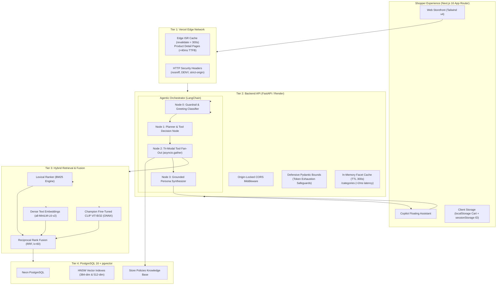

# Toko Marcell — Multimodal Hybrid Retrieval & Agentic AI E-Commerce Engine

[](https://toko-marcell.vercel.app)
[](https://python.org)
[](https://pytorch.org)
[](https://huggingface.co)
[](https://github.com/pgvector/pgvector)
[](https://fastapi.tiangolo.com)
[](https://langchain.com)
[](https://nextjs.org)
[](https://docker.com)

> **Toko Marcell** is an end-to-end, production-deployed e-commerce platform built from scratch to benchmark and deploy **Multimodal Foundation Models (VLMs)**, **Hybrid Lexical-Dense-Visual Vector Retrieval**, and **Agentic AI Copilots with Retrieval-Augmented Generation (RAG)** over 5,300+ catalog items.
>
> 🌐 **Live Storefront:** [https://toko-marcell.vercel.app](https://toko-marcell.vercel.app)  
> 🔬 **Research Report:** [`pipelines/failure_case_analysis.md`](./pipelines/failure_case_analysis.md)  
> 📑 **Literature Review:** [`pipelines/literature_review_clip_finetuning.md`](./pipelines/literature_review_clip_finetuning.md)

---

## 🏗️ System Architecture



---

## 🔬 Multimodal VLM Contrastive Fine-Tuning Study

To solve the fine-grained semantic gap in zero-shot vision-language models (e.g. discriminating between clean dress chinos vs. rugged heavyweight work pants, or specific denim washes), we conducted an offline research study fine-tuning OpenAI's `clip-vit-base-patch32` on **5,378 verified domain image-text pairs** using PyTorch, category-aware hard negative mining, and symmetric InfoNCE loss.

### Benchmark Scoreboard (539 Held-Out Test Pairs)

| Experiment | Architecture / Approach | Recall@1 | Recall@5 | Recall@10 | MRR | Latency (T4 GPU) |
|---|---|:---:|:---:|:---:|:---:|:---:|
| **Zero-Shot Base** | `openai/clip-vit-base-patch32` (Frozen) | 26.53% | 54.92% | 70.69% | 0.4033 | 27.80 ms |
| **PEFT LoRA** | LoRA (EarlyStopped, $r=16, \alpha=32$ on $W_q, W_v$) | 33.40% | 71.61% | 83.49% | 0.5038 | 15.50 ms |
| **SigLIP** | Sigmoid Loss Pre-Training (Pairwise BCE, learned temp/bias) | 35.25% | 71.43% | 82.19% | 0.5091 | 19.38 ms |
| **WiSE-FT** | Weight-Space Ensemble (Decoupled LR + Zero-Shot, $\alpha=0.35$) | 37.85% | 73.28% | 85.53% | 0.5363 | 9.76 ms |
| **🏆 Champion** | **Decoupled LR (ViT 0–5 frozen, Vision 0.2x, Text 1.0x, Proj 2.0x)** | **39.15%** | **78.11%** | **87.20%** | **0.5592** | **14.01 ms** |

#### Key Research Takeaways:
1. **+47.57% Relative Gain in Recall@1 (26.53% → 39.15%, +12.6 pts):** Decoupling learning rates across transformer depths (preserving early visual edge filters while adapting high-level projection layers) strongly outperformed uniform LoRA and SigLIP.
2. **WiSE-FT Weight Ensembling Ablation:** Weight-space ensembling ($\alpha=0.35$) yielded 37.85% Recall@1, while single-model early-stopped Decoupled LR delivered the highest overall retrieval accuracy (39.15% R@1, 0.5592 MRR).
3. **Hardware Export to ONNX:** The fine-tuned champion text encoder was exported to ONNX format ([`models/champion_text_encoder.onnx`](./models/champion_text_encoder.onnx)) with FP16 post-processing for fast CPU/GPU inference serving.
4. **Structured Failure Mode Analysis:** Documented in [`pipelines/failure_case_analysis.md`](./pipelines/failure_case_analysis.md)—analyzing exact failure modes when visual textures conflict with multi-attribute text tokens.

---

## ⚡ Tri-Modal Hybrid Retrieval Engine

Rather than relying purely on vector search, Toko Marcell implements a 3-way hybrid search pipeline combining:
1. **Lexical Retrieval (BM25):** Hand-crafted Robertson & Zaragoza BM25 scoring over title, brand, department, and description. Preserves precision on exact SKU numbers and brand names.
2. **Dense Semantic Retrieval:** 384-dimensional sentence embeddings (`all-MiniLM-L6-v2`) via pgvector HNSW cosine indexing.
3. **Cross-Modal Visual Retrieval:** 512-dimensional CLIP embeddings matching textual queries directly to catalog product imagery or user-uploaded photos.
4. **Reciprocal Rank Fusion (RRF):** Fuses ranking distributions with constant $k=60$:

$$RRF\_Score(d) = \sum_{m \in M} \frac{1}{60 + r_m(d)}$$

---

## 🤖 Tri-Modal Agentic AI Copilot (Admin Toko Marcell)

An autonomous in-store stylist and customer assistant engineered with LangChain and Google Gemini, adhering to strict grounding and anti-hallucination guardrails:

* **Node 0 (Guardrail Classifier):** Intercepts off-topic queries (coding, politics, academic math) and general greetings without invoking costly tools.
* **Deterministic Function Calling:** Bound strictly to 4 whitelisted tools (`search_catalog`, `get_product_details`, `search_by_image`, `lookup_store_policy`).
* **Sizing & Fit Consultation (TB/BB):** Contextual RAG calculating body height/weight standards and brand-specific deviations (e.g. Dickies 874 waist tightness vs. Levi's 501 regular fit).
* **Occasion-Based Outfit Builder:** Recommends matching Top + Bottom + Shoes while enforcing user budget constraints.
* **Token Safeguards:** Compact tool representations truncate payloads to protect LLM context windows and upstream API quotas.

---

## 🛡️ Production Reliability, Caching & Defensive Security

Designed to operate reliably and fast on cloud free tiers (Render + Neon Postgres + Vercel):

* **Edge CDN Caching (Next.js ISR):** Product detail routes export `revalidate = 300` (5 minutes) for automatic stale-while-revalidate caching on Vercel's Edge CDN, dropping TTFB to **<40ms**.
* **Database Offloading:** Frequently queried facets (`/categories`) utilize in-memory TTL caching, reducing Neon PostgreSQL `GROUP BY` database queries from ~60ms to **~2ms**.
* **HTTP Cache-Control Headers:** Public catalog endpoints emit `public, max-age=60, s-maxage=300, stale-while-revalidate=60`.
* **AI Token Safeguard:** `/copilot/chat` enforces strict Pydantic schema boundaries (`max_length=2000` chars/msg, max 20 messages in conversation history, max 8MB image payload) to prevent token exhaustion attacks.
* **Origin-Locked CORS:** Restricted to trusted production and staging domains (`localhost` + `*.vercel.app`).
* **Security Headers:** Enforces `X-Content-Type-Options: nosniff`, `X-Frame-Options: DENY`, and strict referrer policies.
* **Reverse Proxy IP Forwarding:** Uvicorn runs with `--proxy-headers` for accurate client IP tracking.

---

## 🚀 Quickstart & One-Command Local Run

Toko Marcell is containerized with **Docker Compose** for instant, zero-friction local reproducibility. All services—**Next.js 16 Storefront**, **FastAPI Backend**, and **PostgreSQL 16 with pgvector (auto-seeded with 4,670 verified products, 46,700 reviews, and precomputed vector embeddings)**—launch with a single command.

### 1. Configure Gemini API Key
```bash
cp .env.example .env
```
Open `.env` and set your key:
```env
GEMINI_API_KEY=AIzaSy...  # Free key from https://aistudio.google.com/
```
*(Catalog browsing, hybrid BM25 + dense vector search, category filtering, item recommendations, and demo checkout work out-of-the-box even without an API key; the key powers the interactive Tri-Modal AI Copilot).*

### 2. Launch Fullstack Stack (1 Command)
```bash
./run-local.sh
```
*Or directly with Docker Compose:*
```bash
docker compose up -d --build
```
> **Automatic Data Seeding:** The PostgreSQL container automatically restores the complete catalog, HNSW vector indexes, authentic customer reviews, and RAG knowledge embeddings within ~5 seconds upon first boot from `data/seed/init.sql.gz`. No manual data pipelines or downloads needed!

### 3. Access Local Services
- 🌐 **Web Storefront:** [http://localhost:3000](http://localhost:3000)
- ⚡ **Interactive API Docs:** [http://localhost:8001/docs](http://localhost:8001/docs)
- ❤️ **API Health Status:** [http://localhost:8001/health](http://localhost:8001/health)

To stream service logs or shut down:
```bash
docker compose logs -f    # Stream real-time logs
docker compose down       # Graceful shutdown
```

### 4. Run Automated Test Suites
```bash
# Frontend component & session tests (13 tests)
cd shop && npm test

# Backend API integration & search tests (40 tests)
cd api && python3 -m pytest tests/
```

---

## 📁 Repository Structure

```
manual/
├── api/                    # FastAPI Backend Service
│   ├── agent.py            # Tri-Modal Multi-Agent Copilot Orchestrator
│   ├── agent_tools.py      # Deterministic Function Calling Tools
│   ├── main.py             # REST API & Caching Layer
│   ├── search.py           # BM25 Lexical & Hybrid Vector Search Engine
│   ├── knowledge/          # Store Policies & Size Chart Knowledge Base (RAG)
│   ├── docker-compose.yml  # Containerized Multi-Service Deployment
│   └── tests/              # Pytest Test Suites
├── shop/                   # Next.js 16 Frontend Application
│   ├── src/app/            # App Router (Pages, Product Details, ISR, Checkout)
│   ├── src/components/     # UI Components (Catalog, CopilotChat, Visual Search)
│   └── src/lib/            # Client API, Session & LocalStorage Cart State
├── pipelines/              # ML Research & Benchmarking Pipelines
│   ├── train_clip.py       # PyTorch Contrastive Fine-Tuning Pipeline
│   ├── experiments_clip.py # 4-Way Comparative Model Evaluation
│   ├── eval_search.py      # Search Retrieval Evaluator (Recall@K, nDCG, MRR)
│   ├── failure_case_analysis.md            # Empirical Research Study
│   └── multimodal_benchmark_results.json   # Machine-Readable Leaderboard
├── models/                 # Model Checkpoints & ONNX Exported Weights
└── render.yaml             # Cloud Infrastructure as Code (Render)
```

---

## 👨‍💻 Author

**Marcell Hermawan Kristianto**  
*Data Science, BINUS University (GPA 3.85 / 4.00, Dean's List)*  
- **Email:** [marcellkristianto.ai@gmail.com](mailto:marcellkristianto.ai@gmail.com)  
- **LinkedIn:** [linkedin.com/in/marcell-hermawan-kristianto](https://linkedin.com/in/marcell-hermawan-kristianto)  
- **Portfolio:** [marcell-kristianto.vercel.app](https://marcell-kristianto.vercel.app)
