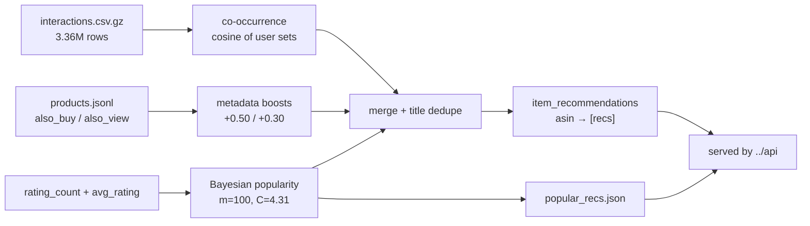
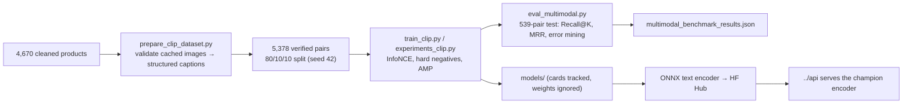

# `pipelines/` — data engineering, embeddings, and the ML research harnesses

Everything that runs **offline**. This folder turns an open research dataset into the real data Toko
Marcell serves online: the product catalog, the vector embeddings, the recommendation tables, the
review corpus, and the multimodal image–text dataset used for the VLM fine-tuning study.

There is no mock data. `../shop` no longer ships a hard-coded product array — if the pipeline has not
run, the shop is empty.

```text
data/raw (2.8 GB, gitignored) → build_catalog.py → data/processed (gitignored)
        → seed.py → PostgreSQL → embed_* → recs/reviews → served by ../api
```

> **Fast path:** you do not need any of this to run the app. `../data/seed/init.sql.gz` is a
> committed dump of the cleaned database, so `docker compose up` boots a fully populated stack in
> seconds. This folder exists for provenance and reproducibility.

---

## 1. Source dataset

| | |
|---|---|
| Dataset | **Amazon Reviews 2018**, category *Clothing, Shoes & Jewelry* |
| Released by | McAuley Lab, UC San Diego — [dataset page](https://cseweb.ucsd.edu/~jmcauley/datasets/amazon_v2/) |
| Paper | Ni, Li, McAuley — *Justifying recommendations using distantly-labeled reviews and fine-grained aspects* (EMNLP 2019) |
| Files | `Clothing_Shoes_and_Jewelry_5.json.gz` (reviews, 1.27 GB) · `meta_Clothing_Shoes_and_Jewelry.json.gz` (metadata, 1.57 GB) |
| Licence | Free for **research / non-commercial** use. Product text and images remain Amazon's property; images are hot-linked, never re-hosted. |

**Why this dataset.** It is the canonical recommender-systems benchmark, so HR@10 / nDCG@10 numbers
are comparable with published results instead of being self-reported in a vacuum. It also carries
exactly the fields the product needs: real titles, brands, prices, category trees, feature bullets and
descriptions (search + NLP), user_id / asin / rating / timestamp (recommendations), and `also_buy` /
`also_view` (a ready-made co-view signal).

**Why not the 2023 refresh.** `McAuley-Lab/Amazon-Reviews-2023` was tried first and rejected on
evidence: in `Amazon_Fashion`, **90% of items have no price** and the `categories` field is empty,
which makes a shop catalog impossible.

> The old plan mentioned "synthetic events" for recommendations. That was upgraded: interactions are
> **real** — 3.36 M genuine user–item rows with timestamps — so time-based splits and HR@10 are
> meaningful, not self-graded.

---

## 2. Reproduce

```bash
cd manual

# 1. download raw files (~2.8 GB, resumable, gitignored)
bash pipelines/download_data.sh

# 2. build the catalog + interactions (~8 min, stdlib only, no pandas)
python3 pipelines/build_catalog.py

# 3. load it into Postgres
cd api && docker compose run --rm seed --reset
```

Outputs land in `data/processed/` (gitignored — regenerate instead of committing):

| File | Size | What it is |
|---|---|---|
| `products.jsonl` | ~6.6 MB | 6,000 real products → seeds Postgres |
| `interactions.csv.gz` | ~43 MB | `user_id, asin, rating, timestamp` — 3,363,680 rows |
| `categories.json` | small | departments + top category names → shop filter chips |
| `stats.json` | small | **every number quoted in this README** |

Peak memory stays flat (three streaming passes, no pandas) because the build machine has little RAM to
spare.

---

## 3. What the catalog build does

```
pass 1  reviews   → interactions per item + rating sum          (11,285,464 reviews read)
pick    top candidates by interactions (8× the catalog size)
pass 2  metadata → quality filters, category vocabulary, brand lookup
pass 3  reviews   → interactions.csv.gz for the kept items only
```

### Real-data traps this handles (each found the hard way)

| Trap | Handling |
|---|---|
| Every value is a **string**, including numbers (`"overall": "5.0"`) | `to_float` / `to_int` coercion |
| `category`, `description`, `imageURLHighRes` are **Python-repr strings**, not JSON | `ast.literal_eval` with a regex fallback |
| Amazon glues **spec bullets onto the category path** (`"Rubber sole"`, `"Imported"`) | only the first 4 path nodes are considered, plus a 30-entry spec stoplist |
| Category branches are near-unique junk strings | a name must repeat ≥150 times among candidates to count as a category (131 survive) |
| **Duplicate ASINs** (361 repeated metadata rows) | de-duplicated; the drop count is recorded |
| `brand` missing on many rows — including *Levi's 501* | matched against brand spellings in the file; `brandSource` records `metadata` vs `title_match` |
| 65% of items have **no price**, 39% have **no image** | both required, so candidates are drawn from an 8× larger pool |
| Prices are ranges (`"$11.13 - $117.19"`) | lowest variant price is taken |
| Some scraped rows carry HTML/script junk in the title | dropped (`scraped_script_title`: 621) |

### Filters applied to become a product

`title` present · price parseable and between $1 and $1000 · image URL present · ≥6 interactions.
Recorded drops from `stats.json`: **11,358 for no price**, **1,786 for no image**, **361 duplicate
metadata rows**, **621 scraped-script titles**. The top **6,000** products by interaction count are
kept (all distinct ASINs).

---

## 4. What the catalog actually contains (build = 6,000 products)

| Metric | Value |
|---|---|
| Products | 6,000 (all distinct ASINs) |
| Departments | Women 3,409 · Men 1,887 · Girls 151 · Boys 131 · Baby 116 · Other 306 |
| Categories | all 6,000 have one; top are Lingerie 452, Jeans 212, Novelty 212, Casual 192, Fashion Sneakers 183, Shoes 164, Running 160, Flats 154 |
| Brands | 5,371 products (90%) — 2,954 matched from metadata, 2,417 from the title; 1,500 distinct brands |
| Description | 4,689 products |
| Feature bullets | 5,957 products |
| Co-view links (`also_buy` / `also_view`, restricted to the catalog) | 3,453 products |
| Interactions | 3,363,680 rows from 972,184 users |
| Interactions per product | min 198 · median 333 · max 19,693 |
| Price (USD) | min 1.00 · median 17.86 · p90 49.99 · max 275.00 |
| Matrix | 3,363,680 / 5,833,104,000 cells = **0.058% dense** |

The long tail is real: the most-reviewed item has 19,693 interactions while the minimum in the catalog
is 198 — a ~99× spread across just the kept items.

### 6,000 built → 4,670 served

After the build, `cleanup_catalog.py` runs against the live database and removes:

1. products with a **dead image CDN link** (`image_embedding IS NULL`), and
2. **duplicate title variants**, keeping the best-rated/most-reviewed row.

Dependent reviews are deleted too, then `VACUUM ANALYZE` runs. The shipped seed and the storefront
copy therefore read **4,670 products / 46,700 reviews**. The ML artifacts (embeddings, splits, recs)
are built from the 6,000-product catalog; the served catalog is the cleaned 4,670. Both numbers are
correct in their own context, and the READMEs say which is which.

---

## 5. Vector embeddings

| Script | Model | Dim | Column | Index |
|---|---|:---:|---|---|
| `embed_catalog.py` | `sentence-transformers/all-MiniLM-L6-v2` (fastembed/ONNX) | 384 | `products.embedding` | HNSW cosine |
| `embed_images.py` | `Qdrant/clip-ViT-B-32-vision` (fastembed/ONNX) | 512 | `products.image_embedding` | HNSW cosine |
| `embed_catalog_vlm.py` | **fine-tuned champion CLIP** from `pipelines/Best Model/` | 512 | `products.image_embedding` + offline `.npy`/`.json` | HNSW cosine |
| `export_vision_onnx.py` | exports the champion **vision** tower to ONNX (fp32 + int8) for serving | 512 | `models/champion_vision_encoder{,_int8}.onnx` | — |

> **Do not mix encoders.** The served `products.image_embedding` vectors come from the **fine-tuned
> champion** (`embed_catalog_vlm.py`). `embed_images.py` writes *zero-shot* fastembed vectors instead;
> running it against the serving database would desynchronise the query and document spaces. Use it
> for experiments only. The API likewise has **no** zero-shot fallback — it returns `503` if the
> champion vision encoder is missing.

Text representation for MiniLM is `title + brand + category + features + description` — the same
fields BM25 indexes, so the two rankers see the same evidence and their disagreement is genuinely
about *method*, not data.

`embed_catalog_vlm.py` also exposes `--skip-db` to produce the standalone
`data/processed/catalog_embeddings.npy` + `catalog_items.json` used for offline search experiments.

`download_images.py` prefetches and caches catalog images to `data/processed/images/` (40 threads) so
the VLM dataset and image embeddings do not re-hit Amazon's CDN.

---

## 6. Recommendations

Recommendations are built offline by `build_recs.py` and served by three API endpoints. There are no
fabricated "you may also like" lists: every rail comes from the real 3.36 M-interaction log plus the
catalog's own `also_buy`/`also_view` graph.

**Signals, and how they combine:**

1. **Popularity, Bayesian-smoothed.** A raw average rating rewards a product with three 5-star
   reviews. The baseline shrinks it toward the catalog mean instead:

   $$\text{score} = \frac{n \cdot \bar{r} + m \cdot C}{n + m}$$

   with prior weight `m = 100` and prior mean `C = 4.31`. Global top-50 and top-30 per department,
   deduplicated by title. Written to `popular_recs.json` and used as the cold-start fill pool.

2. **Item-to-item co-occurrence.** Cosine similarity over per-item user sets:
   `cos(i,j) = co(i,j) / (√n_i · √n_j)`, where `co(i,j)` counts users who interacted with both items.
   Ultra-popular items are capped at 5,000 sampled users so the candidate product stays bounded.

3. **Metadata boosts.** `also_buy` adds `+0.50` and `also_view` adds `+0.30` to a candidate's score,
   so explicit co-purchase signals outrank coincidental co-views.

4. **Title dedupe + cold fill.** Variants sharing a title are collapsed. Each item keeps up to 12
   recommendations; anything with fewer than 6 is backfilled from **category popularity**, then
   **department popularity** — so no rail is ever empty.



Outputs: `data/processed/item_recs.json` (up to 12 recs/ASIN), `data/processed/popular_recs.json`
(global + per department), and the `item_recommendations` Postgres table (6,000 rows in the seed).

`eval_recs.py` measures them: **sequential leave-one-out** on active users (≥5 interactions) where the
held-out target is the user's final interaction and the penultimate interaction is the session
context — i.e. a realistic "recommend the next thing from the current PDP" setup. It reports HR@10,
HR@5, MRR@10 and nDCG@10 against random and global-popularity baselines and prints the relative gains.

The online side (session recommendations, item recs, popularity) and the offline side (real
long-horizon interaction history) cover each other's blind spots — see
[`../api/README.md`](../api/README.md#recommendations) for the serving logic.

---

## 7. Reviews

`extract_reviews.py` streams the 1.27 GB raw reviews file and keeps up to **10 authentic reviews per
catalog ASIN** (rating, summary, comment, verified flag, date), writing them to the `reviews` table —
**46,700** rows in the seed. These power the PDP review section and the copilot's aspect-level social
proof. They are real user reviews, attributed to their (public) reviewer display names.

---

## 8. The multimodal VLM study

This is the ML research core of the project. The question: *can domain-adapting CLIP on this catalog
measurably improve fine-grained fashion retrieval, and which fine-tuning strategy wins?*



### Dataset preparation

`prepare_clip_dataset.py` validates the locally cached images (>500 bytes, readable JPEG), builds
structured captions (`Brand + Title + (Category / Department) + first fabric features`), and splits
deterministically into **4,302 train / 537 val / 539 test**. Summary:
`data/processed/clip_dataset_summary.json` (5,378 pairs; 622 skipped for a missing image).

### Training

`train_clip.py` is the base PyTorch trainer: symmetric InfoNCE, category-aware hard-negative
`BatchSampler`, mixed precision + gradient scaling, cosine annealing with warmup, validation Recall@1
checkpointing. `experiments_clip.py` implements the four ablations:

| Flag | Experiment | Idea from |
|---|---|---|
| `--exp baseline` | full fine-tune, InfoNCE | Chia et al., Fashion-CLIP (2022) |
| `--exp lora` | LoRA on `q_proj`, `v_proj` | Hu et al., LoRA (2021) |
| `--exp siglip` | pairwise sigmoid loss | Zhai et al., SigLIP (2023) |
| `--exp decoupled_lr` | freeze ViT 0–5, asymmetric LRs | Wortsman et al., WiSE-FT (2022) |

The full study ran on **Kaggle GPU (Tesla T4 16 GB)**, AMP FP16, 3 epochs, batch 64, base LR 5e-6.

### Results (539 held-out pairs) — authoritative leaderboard

| Experiment | Recall@1 | Recall@5 | Recall@10 | MRR | Latency (T4) |
|---|:---:|:---:|:---:|:---:|:---:|
| Zero-shot base CLIP | 26.53% | 54.92% | 70.69% | 0.4033 | 27.80 ms |
| PEFT LoRA | 33.40% | 71.61% | 83.49% | 0.5038 | 15.50 ms |
| SigLIP | 35.25% | 71.43% | 82.19% | 0.5091 | 19.38 ms |
| WiSE-FT ensemble (α=0.35) | 37.85% | 73.28% | 85.53% | 0.5363 | 9.76 ms |
| **🏆 Decoupled LR** | **39.15%** | **78.11%** | **87.20%** | **0.5592** | **14.01 ms** |

**+12.62 points absolute / +47.57% relative Recall@1 over zero-shot.** Machine-readable:
[`multimodal_benchmark_results.json`](./multimodal_benchmark_results.json). Full narrative and
qualitative failure cases: [`failure_case_analysis.md`](./failure_case_analysis.md); the hypotheses are
derived in [`literature_review_clip_finetuning.md`](./literature_review_clip_finetuning.md).

> **Reproducibility note.** `experiments/lora` and `models/fashion_clip` also contain *small local
> smoke runs* (batch 8, 1 epoch) whose test metrics are much higher — they ran against a tiny
> evaluation slice and are kept only as sanity checks for the training loop. The **539-pair Kaggle
> leaderboard above is the authoritative result.** If you are reading a number elsewhere in this repo,
> it should reconcile with this table and the JSON.

### Export to production

The champion's **text encoder was exported to ONNX** for cheap CPU inference and is published at
[`Marcell-Kristianto/toko-marcell-clip`](https://huggingface.co/Marcell-Kristianto/toko-marcell-clip).
`../api/search.py` downloads it at runtime (or uses a local copy), runs it with ONNX Runtime on CPU
(< ~150 MB RAM, 2 intra-op threads), and falls back to fastembed's general CLIP if it is unavailable.
Model **weights** themselves are **gitignored** (large binaries); the small model cards, adapter
configs and experiment summaries under `models/experiments/` are tracked. The HF hub artifact is the
production contract.

---

## 9. Evaluation harnesses at a glance

| Harness | Protocol | Metrics |
|---|---|---|
| `eval_search.py` | 32 queries in 4 groups (brand/SKU, category+features, semantic, Indonesian/casual), BM25 vs hybrid | HitRate@10, Precision@10, MRR@10, nDCG@10 |
| `eval_recs.py` | sequential leave-one-out, ≥5 interactions/user, random + popularity baselines | HR@10, HR@5, MRR@10, nDCG@10 |
| `eval_multimodal.py` | 539-pair text→image retrieval, zero-shot vs fine-tuned | Recall@1/5/10, MRR, mean rank, latency, rank-migration mining |
| `eda_interactions.py` | interaction EDA | volume, coverage, sparsity, long tail, rating distribution, temporal span |
| `tests/test_pipeline_math.py` | unit tests for pipeline maths (no DB) | — |

All harnesses print human-readable tables and are safe to run repeatedly against a local stack.

---

## 10. Script reference

| Script | Purpose |
|---|---|
| `download_data.sh` | resumable download of the two raw Amazon files |
| `build_catalog.py` | 3-pass streaming build → `products.jsonl`, `interactions.csv.gz`, `stats.json` |
| `seed.py` | upsert catalog → Postgres (offline compose profile) |
| `cleanup_catalog.py` | remove dead-image and duplicate-title rows (6,000 → 4,670) |
| `download_images.py` | prefetch product images to the local cache |
| `embed_catalog.py` | MiniLM 384-d text embeddings + HNSW |
| `embed_images.py` | fastembed CLIP 512-d image embeddings + HNSW |
| `embed_catalog_vlm.py` | fine-tuned champion CLIP image embeddings (+ offline `.npy`) |
| `export_vision_onnx.py` | export the champion vision tower to ONNX (fp32 + int8) for torch-free serving |
| `build_recs.py` | co-occurrence + metadata boosts + Bayesian popularity + category/department backfill |
| `extract_reviews.py` | ≤10 real reviews per ASIN → `reviews` |
| `eda_interactions.py` | interaction EDA |
| `prepare_clip_dataset.py` | 5,378 verified pairs → 80/10/10 splits |
| `train_clip.py` | PyTorch InfoNCE trainer (hard negatives, AMP, warmup) |
| `experiments_clip.py` | the 4 fine-tuning ablations |
| `eval_multimodal.py` | multimodal retrieval evaluation + failure mining |
| `eval_search.py` | BM25 vs hybrid IR harness |
| `eval_recs.py` | recommendation HR/nDCG harness |
| `migrate_to_neon.py` | local → Neon serverless migration (schema, catalog, embeddings, indexes) |
| `kaggle/` | notebook + CLI metadata for the GPU study |

---

## 11. Kaggle workflow

The GPU study is packaged for Kaggle's free tier. Full step-by-step instructions (auth, dataset
upload, kernel push, output download, and the web-UI alternative) live in
[`kaggle/README.md`](./kaggle/README.md). In short: build a ~165 MB dataset of the JSON splits +
`images.tar.gz`, push the notebook with `"enable_gpu": "true"`, and pull the resulting checkpoints and
`experiment_summary.json` files back into `models/`.

---

## 12. Decisions you may want to revisit

1. **Prices are USD, the shop shows IDR.** `--usd-idr` defaults to `16000`, a *fixed demo rate*
   recorded in `stats.json`. It is a presentation conversion, not a live rate; real prices stay
   untouched in `price_usd`.
2. **The catalog is multi-brand — decided, not accidental** (Levi's, Dickies, TOMS, Birkenstock,
   Timex…). Multi-brand is **not** multi-vendor: one seller, one catalog, one checkout, no marketplace
   mechanics. Filtering to a single brand was rejected because it would shrink the catalog and weaken
   the recommendation signal without improving the product story.
3. **`products.id` is a stable integer** (`1..6000`, ordered by interaction count) because FastAPI and
   the cart use ints; `asin` stays the ML/event key. Deterministic across runs.
4. **Images are hot-linked** from Amazon's CDN rather than re-hosted, to respect the dataset licence
   and keep the repo light.
5. **`data/processed/` is gitignored**, but the cleaned seed is committed so the demo runs without an
   8-minute pipeline.
6. **Dedupe before pagination.** Title sharing variants are collapsed in the clean-up step and again
   in search, so `total` counts reachable results.

---

## 13. Known gaps

- The build fits 6,000 products; the served catalog is the cleaned 4,670. Re-running the full ML suite
   against the cleaned catalog (rather than the 6,000 build) is a fair next step.
- The qualitative failure analysis in `failure_case_analysis.md` comes from an earlier evaluation
  pass; its aggregate table is superseded by `multimodal_benchmark_results.json` and the leaderboard
  above. The case studies are still useful as illustrations of *why* zero-shot CLIP fails on fabric
  and cut.
- Pipeline outputs are not yet published as CI artifacts; reproducing a leaderboard number currently
  means running the harness locally.
- No automated data-quality gate: `build_catalog.py` records its drops in `stats.json`, but nothing
  fails the build if the distribution shifts.

---

### Related docs

- [`BENCHMARKS.md`](./BENCHMARKS.md) — the source ledger for every headline number
- [`../README.md`](../README.md) — project overview and architecture
- [`../api/README.md`](../api/README.md) — how the served catalog, search and copilot work
- [`kaggle/README.md`](./kaggle/README.md) — running the GPU study
