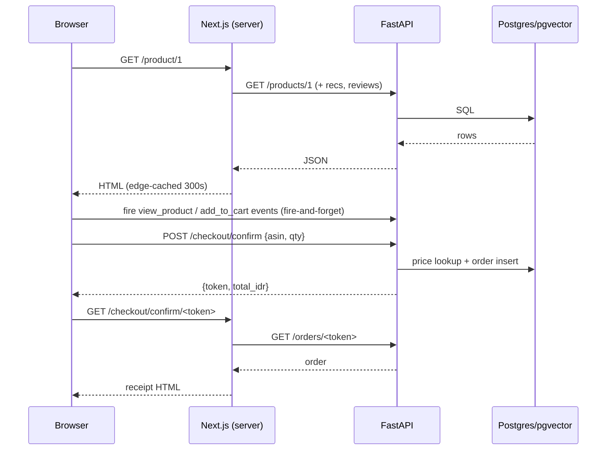

# `shop/` — Toko Marcell storefront (Next.js 16 App Router)

[](https://nextjs.org)
[](https://react.dev)
[](https://tailwindcss.com)
[](https://vitest.dev)
[](https://toko-marcell.vercel.app)

The client-facing storefront. It renders the catalog, runs client-side search/filter/visual-search
UX, keeps the cart in `localStorage`, and talks to the FastAPI backend over HTTP. It never touches a
database and never decides a price.

🌐 **Live:** [https://toko-marcell.vercel.app](https://toko-marcell.vercel.app)

---

## Why it is built this way

A recruiter opening this link decides in seconds whether it works. That drove four deliberate choices:

1. **Server-render first paint, hydrate interaction.** Home and product pages are React Server
   Components; only the parts that need state (`Catalog`, cart, copilot, wakeup) are client
   components. No JS bundle is needed to see the page.
2. **Cache aggressively, revalidate in the background.** Product detail pages are ISR-cached at the
   edge for 5 minutes.
3. **Never show a broken-looking page.** The backend is on a free tier that sleeps; the UI detects
   that and explains it (see the wakeup overlay).
4. **The client cannot lie about money.** The cart sends `{asin, qty}` only; the server computes the
   order total.

---

## Feature tour

### 1. Catalog (`components/Catalog.js`)

- Product grid with **24-per-page** pagination and skeleton placeholders while loading.
- **Department filter chips** from the live `/categories` facets.
- **Debounced text search** (250 ms) that calls the backend `/search` endpoint, so ranking is
  server-side (BM25 + dense vectors + RRF) rather than a client filter.
- **Visual search**: upload a photo and the catalog calls `POST /search/image` (CLIP embeddings).
- URL-driven state (`?department=`, `?page=`, `?q=`), so filtered/search views are shareable and the
  back button behaves.
- A visible "taking longer than usual" state after 1 s so a cold backend never looks frozen.

### 2. Cold-start wakeup overlay (`components/ServerWakeup.js`)

Render's free tier spins the API down after ~15 minutes idle; the next request can take 30–50 s. The
storefront makes this a designed state instead of a failure:

- Debounced (600 ms) `GET /health` on mount — fast servers never see the overlay.
- If slow: a **fullscreen frosted-glass overlay** with a spinner and an honest message
  (*"Membangunkan server… Render free tier cold start (~30–50 dtk)"*).
- On success: a green *"Server siap & aktif!"* badge for 2.5 s, then unmount.
- On failure: **retry** and **dismiss** controls, so the user is never trapped.

`checkHealth()` in `lib/api.js` falls back to `/categories` if `/health` is blocked by a browser
shield, because a false "down" is worse than a heavier probe.

### 3. Floating AI copilot (`components/CopilotChat.js` + `FloatingCopilot.js`)

- A chat panel mounted globally in `layout.js`, loaded with `dynamic(..., { ssr: false })` so it never
  costs first paint. A floating **"Tanya Admin"** button opens it; **Escape** closes it, and controls
  carry `aria-label`s.
- **Text-only (v2).** The chat sends a single `message` plus a browser `thread_id` to
  `POST /copilot/chat`; conversation history lives server-side in the LangGraph checkpointer, not in
  the request. **There is no image upload** — photo search is a separate storefront feature (see
  Catalog, below).
- **Page-aware starter chips** differ between the home page and a product page.
- Replies render **numbered product cards** (`[1]`, `[2]`) with **fit badges**, each exposing
  **Tanya**, **Bandingkan** (compare tray, max 3), **Ukuran?** and **+ Keranjang** actions.
- An inline **TB/BB size form** (triggered by a `size_form` ui_action), **follow-up suggestion chips**,
  and an **add-to-cart confirmation with a "Batalkan" undo**.
- A **pinned product chip** shows which product the conversation is anchored to, and a **reset button**
  clears the thread (`DELETE /copilot/threads/{id}` + wipes the local copy).

### 3b. Product-page copilot entry (`components/ProductCopilotEntry.js`)

On a product page, a **"Tanya soal produk ini"** box shows the product's fit badge and quick chips
("Ukuran saya pas yang mana?", "Bahannya panas nggak?", "Yang mirip tapi lebih murah?"). Clicking any
chip opens the copilot **pinned to that product** so follow-ups resolve to the right ASIN.

### 4. Cart without accounts (`components/CartProvider.js`)

- React Context + `localStorage` under the key **`toko-cart-v2`**, persisted across tabs and refresh.
- Supports add / increase / decrease / set-qty (clamped 1–99) / remove / clear, with `subtotal` and a
  derived `cartCount`.
- Each line stores `{id, asin, title, priceIdr, imageUrl, qty}`. The `asin` is required for the server
  to price the cart, which is why the storage key was bumped from v1 — an old v1 line has no asin and
  cannot be priced, and a silent migration would have produced unpriceable lines.
- `add_to_cart` funnel events are emitted for **every** entry point (card, PDP, copilot), so the funnel
  cannot miss a path.

### 5. Product detail with ISR (`app/product/[id]/page.js`)

- `export const revalidate = 300` → stale-while-revalidate at Vercel's edge.
- Breadcrumb, brand, rating, formatted IDR price, feature bullets, description, real customer reviews,
  and a **"Customers also viewed"** rail fed by `/recs/item/{asin}`.
- `generateMetadata` produces a per-product `<title>`/description for sharing.
- `TrackView` fires a `view_product` event on mount (deduplicated per ASIN).

### 6. Demo checkout (`app/checkout`, `checkout/qris`, `checkout/confirm/[token]`)

- `/checkout` shows the order summary and fires `checkout_start` once per visit.
- `/checkout/qris` renders a clearly-labelled **QRIS simulation**; "I have paid" calls
  `POST /checkout/confirm`, which creates the authoritative order server-side and returns a secret
  token.
- `/checkout/confirm/[token]` **fetches** the order (it is a server component) and renders it. An
  invalid token renders a 404, never a fake receipt. `ClearCart` empties the local cart on success.
- The client sends only `{asin, qty}`; the server prices it. A tampered total cannot get through.

### 7. Recommendations & reviews

- `RecommendationsRail` on the home page calls `/recs/session` (falls back to global popularity when
  the visit is cold) and exposes a "load more" control.
- `ProductReviews` renders the star breakdown and real review text from `/products/{id}/reviews`.

---

## Tech stack

| Layer | Choice |
|---|---|
| Framework | **Next.js 16** (App Router, RSC, Turbopack) |
| Runtime UI | **React 19** |
| Styling | **Tailwind CSS v4** + `Geist` variable font (`next/font`, `display: swap`) |
| State | React Context + `localStorage` (no state library) |
| Icons | Inline SVG (no icon dependency) |
| Tests | **Vitest 5** + Testing Library + jsdom 30 |
| Hosting | Vercel (edge ISR + security headers) |

---

## Getting started

```bash
cd manual/shop
npm install
```

Create `shop/.env.local`:

```env
NEXT_PUBLIC_API_URL=http://localhost:8001
```

```bash
npm run dev      # http://localhost:3000
npm test         # 20 tests across 5 suites
npm run lint
npm run build
```

The API URL is resolved per environment in `lib/api.js`: on the server it prefers
`INTERNAL_API_URL` (container networking, e.g. `http://api:8000`), on the client it uses
`NEXT_PUBLIC_API_URL`. The built-in fallback is `http://localhost:8001`, so a **production deploy must
set `NEXT_PUBLIC_API_URL`** (and ideally `INTERNAL_API_URL` for server-side fetches) or the browser will
look for a backend on localhost.

---

## Environment variables

| Variable | Used | Default | Purpose |
|---|---|---|---|
| `NEXT_PUBLIC_API_URL` | client + server | `http://localhost:8001` | Public API base URL (**required** in production) |
| `INTERNAL_API_URL` | server only | falls back to `NEXT_PUBLIC_API_URL` | Container-internal API URL (avoids a round trip through the public host) |

---

## Component & route map

```text
src/
├── app/
│   ├── layout.js                 # header, footer, CartProvider, ServerWakeup, FloatingCopilot
│   ├── page.js                   # home: hero, RecommendationsRail, Catalog (Suspense)
│   ├── globals.css               # Tailwind v4 theme + design tokens
│   ├── product/[id]/page.js      # PDP with ISR (revalidate = 300), metadata, recs, reviews
│   ├── cart/page.js              # cart overview
│   └── checkout/
│       ├── page.js               # order summary (fires checkout_start)
│       ├── qris/page.js          # QRIS simulation → server-confirmed order
│       └── confirm/[token]/page.js   # server-fetched receipt; 404 on bad token
├── components/
│   ├── Catalog.js                # grid, search (debounced), department filter, visual search, paging
│   ├── CatalogSkeleton.js        # home Suspense fallback
│   ├── ProductCard.js            # card used in grid + rec rails
│   ├── ProductCardSkeleton.js    # per-card placeholder
│   ├── ProductImage.js           # next/image wrapper for Amazon CDN hostnames
│   ├── AddToCartButton.js        # PDP quantity + add
│   ├── CartLink.js               # header cart badge/count
│   ├── CartProvider.js           # cart context + localStorage (toko-cart-v2)
│   ├── ClearCart.js              # clears the cart on the success page
│   ├── ProductReviews.js         # rating breakdown + review list
│   ├── RecommendationsRail.js    # session recommendations + load more
│   ├── TrackView.js              # fires view_product once per ASIN
│   ├── ServerWakeup.js           # cold-start health ping + overlay
│   ├── CopilotChat.js            # v2 copilot panel (text-only; numbered cards, fit badges, compare tray, size form, undo)
│   ├── ProductCopilotEntry.js    # "Tanya soal produk ini" box on the PDP; opens the copilot pinned to the product
│   └── FloatingCopilot.js        # lazy, client-only mount for the copilot
└── lib/
    ├── api.js                    # the ONLY place that knows the API URL; all fetches
    ├── formatRp.js               # IDR currency formatting
    └── session.js                # anonymous session id + copilot thread id/messages (local storage)
```

### Data flow



---

## Testing

```bash
npm test
```

**20 tests across 5 suites**:

| Suite | Tests | Covers |
|---|:---:|---|
| `components/__tests__/CartProvider.test.jsx` | 7 | empty cart, add, duplicate merge, quantity, remove-at-zero, clear, multi-item subtotal |
| `components/__tests__/AddToCartButton.test.jsx` | 3 | add with quantity, navigate home, existing-quantity display |
| `components/__tests__/ServerWakeup.test.jsx` | 2 | ready indicator on healthy check, spinner while waiting |
| `components/__tests__/CopilotChat.test.jsx` | 6 | no image-upload control (text-only), home vs product starter chips, v2 single-message turn + guardrail, numbered cards with fit badge, reset deletes the thread |
| `lib/__tests__/session.test.js` | 2 | id persists in `sessionStorage`, stable across calls |

CI also runs `npm run lint` and `npm run build` so the Next build cannot regress silently.

---

## Design decisions

- **`lib/api.js` is the single HTTP boundary.** Every fetch, error message and fallback lives there,
  which is why the components stay readable and why the "friendly error, never leak internals" rule
  holds everywhere.
- **URL as state.** Filters/search/pagination live in the query string, not only in React state, so
  views are shareable and navigation works.
- **Fire-and-forget analytics.** `postEvent` swallows errors and uses `keepalive: true`. A dropped
  event is cheaper than a broken purchase.
- **Anonymous identity.** `session.js` generates an id in `sessionStorage` (with a non-secure-context
  fallback for plain-http LAN addresses) — enough to attribute a funnel, not enough to identify a
  person.
- **No UI kit.** Small components with plain Tailwind keep the bundle and the dependency surface small.

---

## Known limitations

- Department filtering is applied server-side on the catalog; the search `results_count` event still
  reflects the loaded page, not the full catalog (tracked as a backend gap).
- The QRIS screen is an explicit simulation and charges nothing; it exists to exercise the
  server-authoritative checkout path.
- The copilot's inline product cards depend on the backend's response schema; if a tool returns no
  products the panel simply shows text.
- Cold starts are handled, not eliminated — the live API is on a free tier.

---

### Related docs

- [`../README.md`](../README.md) — project overview
- [`../api/README.md`](../api/README.md) — endpoints, search internals, checkout guarantees
- [`../pipelines/README.md`](../pipelines/README.md) — where the data comes from
